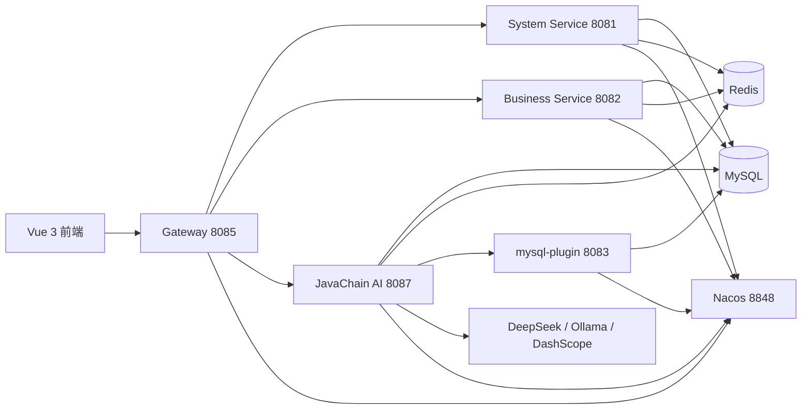

# OA 智能办公管理系统

这是一个基于 Spring Cloud 微服务、Vue 3 前端和 JavaChain AI 能力构建的智能办公管理系统。项目包含系统权限管理、业务管理、数据看板、智能对话、知识库问答、RAG 检索、MCP 工具调用和 Agent 执行等模块。

## 项目结构

```text
java-backend
├── gateway                 # API 网关，统一入口与路由转发
├── system-service          # 系统服务：登录、用户、角色、权限、菜单
├── business-service        # 业务服务：商品、订单、营销、看板、聊天
├── javachain               # AI 服务：LLM、RAG、Skills、MCP、Agent
├── oa-frontend             # Vue 3 前端项目
├── sql                     # 数据库建表与初始化脚本
├── src                     # 早期单体后端代码
└── pom.xml                 # 微服务父级 Maven 工程

D:\my_mcp\mysql-plugin       # MCP MySQL 工具服务，Docker 编排中作为独立服务启动
```

## 功能模块

| 模块 | 说明 |
| --- | --- |
| 登录认证 | JWT 登录、登出、当前用户信息获取 |
| 权限管理 | 用户管理、角色管理、权限管理、菜单管理 |
| 业务管理 | 商品管理、订单管理、营销活动管理 |
| 数据看板 | 展示系统业务统计数据 |
| 智能聊天 | 业务侧聊天接口与会话管理 |
| 知识库问答 | 文件向量化、RAG 检索问答、知识库统计 |
| JavaChain Agent | ReAct Agent、任务确认、执行状态查询 |
| MCP 工具 | MCP 服务发现、工具列表、工具执行、插件治理 |
| 定时任务 | business-service 集成 XXL-Job 执行器配置 |

## 系统架构



## 技术栈

| 层级 | 技术 |
| --- | --- |
| 前端 | Vue 3、Vite、Vue Router、Pinia、Element Plus、Axios |
| 网关 | Spring Cloud Gateway、Nacos Discovery、JWT |
| 后端 | Spring Boot 3、Spring Cloud、Spring Cloud Alibaba、OpenFeign |
| 数据访问 | MyBatis、MySQL |
| 缓存 | Redis |
| AI 能力 | LangChain4j、DeepSeek、Ollama、DashScope、RAG、MCP |
| 任务调度 | XXL-Job |
| 构建工具 | Maven、npm |

## 服务端口

| 服务 | 端口 | 说明 |
| --- | --- | --- |
| gateway | 8085 | 前端 API 统一入口 |
| system-service | 8081 | 系统权限服务 |
| business-service | 8082 | 业务管理服务 |
| mysql-plugin | 8083 | MCP MySQL 工具服务 |
| javachain | 8087 | AI Agent 与知识库服务 |
| oa-frontend | 5173 | Vite 默认开发端口 |
| Nacos | 8848 | 服务注册发现 |
| Redis | 6379 | 缓存服务 |
| MySQL | 3306 | 业务数据库 |

## 环境要求

- JDK 17：运行 `gateway`、`system-service`、`business-service`
- JDK 21：运行 `javachain` 和 `D:\my_mcp\mysql-plugin`
- Maven 3.8+
- Node.js 18+
- MySQL 8+
- Redis 6+
- Nacos 2.x+

## 配置说明

启动前需要检查各服务的 `application.yml`：

```text
gateway/src/main/resources/application.yml
system-service/src/main/resources/application.yml
business-service/src/main/resources/application.yml
javachain/src/main/resources/application.yml
```

建议把敏感信息通过环境变量或本地配置注入，不要提交真实密钥。

常用环境变量示例：

```powershell
$env:MYSQL_HOST="localhost"
$env:MYSQL_PORT="3306"
$env:MYSQL_DATABASE="example_db"
$env:MYSQL_USERNAME="root"
$env:MYSQL_PASSWORD="your_password"
$env:REDIS_HOST="localhost"
$env:REDIS_PORT="6379"
$env:DEEPSEEK_API_KEY="your_deepseek_api_key"
$env:DASHSCOPE_API_KEY="your_dashscope_api_key"
```

## 数据库初始化

1. 创建数据库：

```sql
CREATE DATABASE example_db DEFAULT CHARACTER SET utf8mb4 COLLATE utf8mb4_general_ci;
```

2. 执行业务库完整初始化脚本：

```text
sql/init.sql
```

如需启动 XXL-Job Admin，再执行 `sql/xxl_job.sql` 初始化 XXL-Job 独立库表。

## 启动方式

### 1. 启动基础服务

先启动 MySQL、Redis、Nacos，确保服务地址与各模块配置一致。

### 2. 启动后端微服务

在项目根目录构建父工程：

```powershell
mvn clean package
```

分别启动服务：

```powershell
mvn -pl system-service spring-boot:run
mvn -pl business-service spring-boot:run
mvn -pl gateway spring-boot:run
```

JavaChain 是独立 Maven 工程，进入目录后启动：

```powershell
cd javachain
mvn spring-boot:run
```

### 3. 启动前端

```powershell
cd oa-frontend
npm install
npm run dev
```

浏览器访问：

```text
http://localhost:5173
```

## 网关路由

前端通过网关访问后端服务：

| 前端请求前缀 | 转发目标 |
| --- | --- |
| `/api/system/**` | `system-service` |
| `/api/business/**` | `business-service` |
| `/api/javachain/**` | `javachain` |

## 前端页面

| 路由 | 页面 |
| --- | --- |
| `/login` | 登录页 |
| `/dashboard` | 数据看板 |
| `/system/users` | 用户管理 |
| `/system/roles` | 角色管理 |
| `/system/permissions` | 权限管理 |
| `/system/menus` | 菜单管理 |
| `/business/products` | 商品管理 |
| `/business/orders` | 订单管理 |
| `/business/marketing` | 营销管理 |
| `/business/chat` | 智能聊天 |
| `/business/knowledge` | 知识库问答 |
| `/business/javachain` | JavaChain Agent |

## 构建命令

后端：

```powershell
mvn clean package
```

前端：

```powershell
cd oa-frontend
npm run build
```

JavaChain：

```powershell
cd javachain
mvn clean package
```

## 注意事项

- 不要提交真实 API Key、数据库密码、Nacos 密码、JWT 密钥。
- `target/`、`node_modules/`、`javachain/temp/` 等构建产物应保持在 `.gitignore` 中。
- 如果 GitHub 提示历史提交中包含密钥，需要清理本地未推送提交或重写相关历史。
- `javachain` 使用 JDK 21，其他微服务使用 JDK 17，启动前注意本地 Java 版本。
