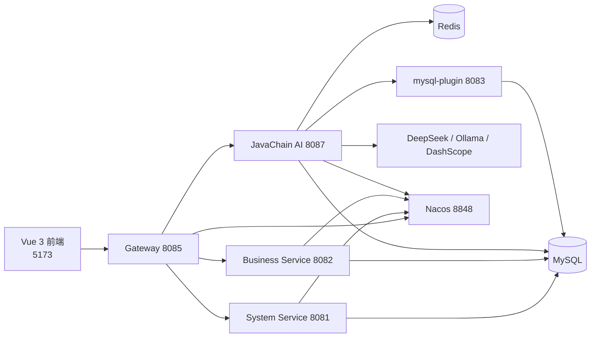

# OA 智能办公管理系统

基于 **Spring Cloud 微服务 + Vue 3 前端 + JavaChain AI 能力**构建的智能办公管理系统。

在传统 OA 的后台管理能力（用户 / 角色 / 权限 / 菜单）与电商业务能力（商品 / 订单 / 营销 / 物流）之上，内置 AI 智能体能力，让用户可以用**自然语言**完成数据查询、知识问答与业务操作。

---

## 快速开始

```bash
# 1. 启动基础服务（MySQL / Redis / Nacos）
docker compose up -d mysql redis nacos

# 2. 初始化数据库
mysql -h127.0.0.1 -P3307 -uroot -p example_db < sql/init.sql

# 3. 构建并启动后端
mvn clean package -DskipTests
mvn -pl system-service spring-boot:run    # 终端 1
mvn -pl business-service spring-boot:run  # 终端 2
mvn -pl gateway spring-boot:run           # 终端 3

# 4. 启动 AI 服务（独立工程，注意 cd）
cd javachain && mvn spring-boot:run

# 5. 启动前端
cd oa-frontend && npm install && npm run dev
```

访问 `http://localhost:5173`。

**一键容器化部署**（需先完成 mvn 打包）：

```bash
cp .env.docker.example .env
docker compose up -d --build
```

详见 [部署运维手册](docs/05-运维/部署运维手册.md)。

---

## 项目结构

```text
java-backend
├── gateway                 # API 网关：统一入口、路由、JWT 鉴权、限流
├── system-service          # 系统服务：登录、用户、角色、权限、菜单
├── business-service        # 业务服务：商品、订单、营销、物流、看板、定时任务
├── javachain               # AI 服务：LLM、RAG、Skills、MCP、Agent（独立 Maven 工程）
├── oa-frontend             # Vue 3 前端项目
├── sql                     # 数据库建表与初始化脚本
├── docker                  # 通用 Dockerfile
├── docs                    # 项目文档（PRD / TRD / API / 数据库 / 运维 / 规范）
├── docker-compose.yml      # 容器编排
└── pom.xml                 # 微服务父级 Maven 工程

D:\my_mcp\mysql-plugin       # MCP MySQL 工具服务（外部项目），编排中作为独立服务启动
```

---

## 系统架构


```mermaid
flowchart LR
    A[Vue 3 前端<br/>5173] --> B[Gateway 8085]
    B --> C[System Service 8081]
    B --> D[Business Service 8082]
    B --> E[JavaChain AI 8087]
    C --> F[(MySQL)]
    D --> F
    E --> F
    E --> G[(Redis)]
    E --> J[mysql-plugin 8083]
    J --> F
    E --> H[DeepSeek / Ollama / DashScope]
    B --> I[Nacos 8848]
    C --> I
    D --> I
    E --> I
```

**请求链路**：`浏览器 → 网关 8085 → 微服务`，所有前端请求统一以 `/api` 为前缀经网关转发。

| 前端请求前缀 | 转发目标 |
| --- | --- |
| `/api/system/**` | `system-service` |
| `/api/business/**` | `business-service` |
| `/api/javachain/**` | `javachain` |

---

## 服务与端口

| 服务 | 端口 | 说明 |
| --- | --- | --- |
| oa-frontend | 5173 | 前端（开发 Vite / 容器 Nginx 80） |
| gateway | 8085 | 前端 API 统一入口 |
| system-service | 8081 | 系统权限服务 |
| business-service | 8082 | 业务管理服务 |
| mysql-plugin | 8083 | MCP MySQL 工具服务 |
| javachain | 8087 | AI Agent 与知识库服务 |
| Nacos | 8848 | 服务注册发现 |
| MySQL | 3307 | 业务数据库（容器内 3306） |
| Redis | 6380 | 缓存（容器内 6379） |
| XXL-Job Admin | 8088 | 任务调度控制台 |

> ⚠️ 容器化部署时 MySQL / Redis / XXL-Job 的宿主机端口做了偏移，**从宿主机连接请使用上表端口**。

---

## 技术栈

| 层级 | 技术 |
| --- | --- |
| 前端 | Vue 3、Vite、Vue Router、Pinia、Element Plus、Axios |
| 网关 | Spring Cloud Gateway、Nacos Discovery、JWT |
| 后端 | Spring Boot 3、Spring Cloud、Spring Cloud Alibaba、OpenFeign |
| 数据访问 | MyBatis、MySQL 8 |
| 缓存 | Redis |
| AI 能力 | LangChain4j、DeepSeek、Ollama、DashScope、RAG、MCP |
| 任务调度 | XXL-Job |
| 运行时 | JDK 21 |
| 构建 | Maven、npm |
| 容器 | Docker、Docker Compose |

---

## 功能模块

| 模块 | 说明 |
| --- | --- |
| 登录认证 | JWT 登录、登出、当前用户信息获取 |
| 权限管理 | 用户、角色、权限、菜单管理（RBAC） |
| 业务管理 | 商品管理、订单管理、营销活动管理、物流管理 |
| 数据看板 | 系统与业务统计概览 |
| 智能聊天 | 会话管理、多轮对话 |
| 知识库问答 | 文档向量化、RAG 检索问答、引用溯源 |
| JavaChain Agent | ReAct 推理、多步工具调用、任务确认 |
| MCP 工具 | 工具发现、列表、执行 |
| 定时任务 | XXL-Job 执行器集成 |

---

## 环境要求

- **JDK 21**（强制）
- Maven 3.8+
- Node.js 18+
- MySQL 8+ / Redis 6+ / Nacos 2.x+
- Docker + Docker Compose（容器化部署）

---

## 文档

完整文档见 **[docs/](docs/README.md)**：

| 文档 | 说明 |
| --- | --- |
| [产品需求文档（PRD）](docs/01-产品/PRD-产品需求文档.md) | 产品定位、功能清单、用户故事、验收标准 |
| [技术设计文档（TRD）](docs/02-技术/TRD-技术设计文档.md) | 架构设计、模块设计、AI 服务设计、技术决策 |
| [API 接口文档](docs/03-接口/API-接口文档.md) | 全部 REST 接口定义与示例 |
| [数据库设计文档](docs/04-数据库/数据库设计文档.md) | 表结构、ER 关系、索引、迁移 |
| [部署运维手册](docs/05-运维/部署运维手册.md) | 部署、端口规划、故障排查、备份 |
| [开发规范与贡献指南](docs/06-规范/开发规范与贡献指南.md) | 编码规范、Git 工作流、审查清单 |

**其他参考**：

- [Docker 快速开始](README-docker.md)
- [AI 助手协作说明](CODEBUDDY.md)
- 各服务说明：[gateway](gateway/README.md) · [system-service](system-service/README.md) · [business-service](business-service/README.md) · [javachain](javachain/README.md) · [oa-frontend](oa-frontend/README.md)
- [数据库脚本说明](sql/README.md)

---

## 注意事项

- **不要提交真实密钥**：API Key、数据库密码、Nacos 密码、JWT 密钥一律用环境变量注入。
- `jwt.secret` 在 gateway、system-service、business-service、javachain **四处必须保持一致**，否则鉴权失效。
- javachain 是**独立 Maven 工程**，必须在 `javachain/` 目录下单独构建。
- 所有 Java 服务统一使用 **JDK 21**，构建前请确认本地 Java 版本。
- `target/`、`node_modules/`、`dist/`、`logs/`、`javachain/temp/` 等构建与运行产物不应提交。
