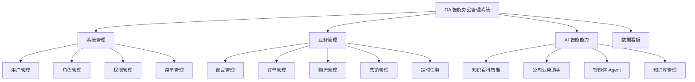
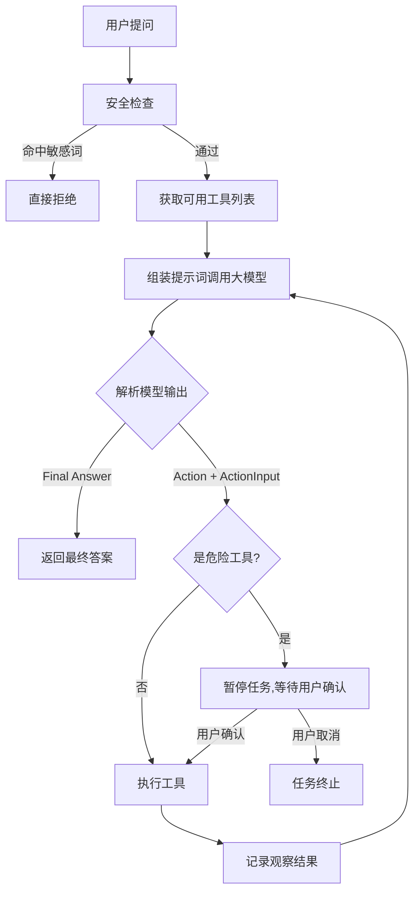

# 产品需求文档（PRD）

> 项目名称：OA 智能办公管理系统
> 文档版本：v1.0
> 最后更新：2026-10-04
> 适用对象：产品、研发、测试、运营

---

## 1. 文档说明

### 1.1 编写目的

本文档定义 OA 智能办公管理系统的产品定位、目标用户、功能范围与验收标准，作为研发实现、测试用例编写与验收的依据。

### 1.2 术语表

| 术语 | 说明 |
| --- | --- |
| OA | Office Automation，办公自动化 |
| RBAC | Role-Based Access Control，基于角色的访问控制 |
| JWT | JSON Web Token，登录凭证 |
| RAG | Retrieval-Augmented Generation，检索增强生成 |
| 知识库 | 存放业务文档并支持向量检索的数据集合 |
| Agent | 智能体，可自主推理并调用工具完成多步任务 |
| MCP | Model Context Protocol，模型工具调用协议 |
| Skill | 技能，由 Markdown 定义的固定执行流程 |
| ReAct | Reasoning + Acting，推理与行动交替的 Agent 模式 |

---

## 2. 产品概述

### 2.1 产品定位

一套面向中小企业的**智能办公管理系统**，在传统 OA 的后台管理能力（用户 / 角色 / 权限 / 菜单）与电商业务能力（商品 / 订单 / 营销 / 物流）之上，内置 AI 智能体能力，让用户可以用**自然语言**完成数据查询、知识问答与业务操作。

一句话概括：**"能对话的后台管理系统"**。

### 2.2 核心价值

| 价值点 | 说明 |
| --- | --- |
| 降低操作门槛 | 用自然语言查订单、查库存、问制度，不必记忆菜单路径与筛选条件 |
| 沉淀业务知识 | 把产品手册、规章制度等文档灌入知识库，形成可溯源的问答能力 |
| 打通业务数据 | 智能体可直接调用工具查询真实数据库，而非凭空作答 |
| 安全可控 | 敏感操作需人工确认，敏感词拦截，操作全程留痕 |

### 2.3 目标用户

| 角色 | 典型诉求 | 主要使用功能 |
| --- | --- | --- |
| 系统管理员 | 管理组织与权限，掌握系统运行状况 | 用户/角色/权限/菜单管理、数据看板、定时任务 |
| 业务运营人员 | 维护商品、跟进订单与物流、配置营销活动 | 商品/订单/物流/营销管理 |
| 普通员工 | 用对话方式查询业务数据与公司知识 | 知识百科智能、公司业务助手、智能体 |
| 决策者 | 快速了解经营概况 | 数据看板 |

### 2.4 用户故事（节选）

| 编号 | 角色 | 用户故事 | 验收标准 |
| --- | --- | --- | --- |
| US-01 | 系统管理员 | 我希望用账号密码登录系统，以便按权限访问功能 | 登录成功返回 Token；密码错误返回明确提示；未登录访问业务页面自动跳转登录页 |
| US-02 | 系统管理员 | 我希望给用户分配角色，以便控制功能访问范围 | 可为用户分配多个角色；角色变更后菜单与权限即时生效 |
| US-03 | 系统管理员 | 我希望配置菜单并指定可访问角色，以便不同角色看到不同菜单 | 菜单支持树形结构与排序；非授权角色登录后看不到对应菜单 |
| US-04 | 业务运营 | 我希望对商品增删改查并调整库存，以便维护商品资料 | 支持分页查询、新增、编辑、删除；商品编码、名称、价格、库存可维护 |
| US-05 | 业务运营 | 我希望维护订单并查看物流轨迹，以便跟进履约进度 | 订单支持分页与状态筛选；物流支持录入运单号并查询实时轨迹 |
| US-06 | 业务运营 | 我希望配置不同类型的营销活动，以便支撑促销节奏 | 支持折扣、秒杀、团购、优惠券四种类型；可设置起止时间与启用状态 |
| US-07 | 普通员工 | 我希望用自然语言提问，系统基于公司文档回答并给出出处 | 回答标注 `[文档X]` 引用来源；知识库无相关内容时明确告知而不是编造 |
| US-08 | 普通员工 | 我希望直接问"我的订单有哪些"就能查到真实数据 | 智能体能调用工具查询数据库并返回结果 |
| US-09 | 普通员工 | 我希望在执行危险操作前得到确认提示 | 触发危险工具时任务暂停并返回待确认状态，用户确认后才执行 |
| US-10 | 所有用户 | 我希望登录状态过期时被友好提示并引导重新登录 | Token 失效时清除本地凭证并跳转登录页 |
| US-11 | 运维人员 | 我希望后端不可用时看到维护提示页 | 网关或后端返回 502/503 时自动跳转维护页 |

---

## 3. 功能范围

### 3.1 功能架构

### 3.2 功能清单

#### 3.2.1 系统管理

| 功能 | 说明 | 优先级 |
| --- | --- | --- |
| 登录认证 | 账号密码登录、登出、获取当前用户信息 | P0 |
| 用户管理 | 用户分页查询、详情、新增、编辑、删除、分配角色 | P0 |
| 角色管理 | 角色分页、详情、新增、编辑、删除、分配权限 | P0 |
| 权限管理 | 权限分页、权限树、菜单权限查询、新增、编辑、删除 | P0 |
| 菜单管理 | 菜单列表、菜单树、按角色查询菜单、新增、编辑、删除 | P0 |

#### 3.2.2 业务管理

| 功能 | 说明 | 优先级 |
| --- | --- | --- |
| 商品管理 | 商品分页、详情、新增、编辑、删除 | P0 |
| 订单管理 | 订单分页、详情、新增、编辑、删除、状态流转 | P0 |
| 物流管理 | 物流录入、列表筛选、轨迹维护、实时轨迹查询 | P1 |
| 营销管理 | 活动分页、详情、新增、编辑、删除、营销类型字典 | P1 |
| 定时任务 | 任务列表、启停、手动触发、执行日志查询 | P2 |

#### 3.2.3 AI 智能能力

| 功能 | 说明 | 优先级 |
| --- | --- | --- |
| 智能对话 | 简单问答、带历史多轮对话 | P0 |
| 知识库问答 | 文档上传、向量化、RAG 检索问答、知识库统计与清空 | P0 |
| 自动工具问答 | 根据问题自动选择工具并执行 | P1 |
| ReAct Agent | 多步推理、工具调用、任务状态查询、人工确认、SSE 流式执行 | P1 |
| MCP 工具 | 工具列表查询、工具执行 | P1 |
| Skills 技能 | 技能列表、重载、按技能执行、自动识别技能 | P2 |
| 天气查询 | 通过 Nacos A2A 协议调用外部天气 Agent | P2 |

---

## 4. 核心功能详述

### 4.1 登录与权限

**流程**：用户输入账号密码 → 后端校验 → 返回 JWT Token → 前端存入 localStorage → 后续请求携带 `Authorization: Bearer <token>` → 网关校验并注入用户身份 → 前端拉取当前用户信息与菜单。

**业务规则**：

1. 密码以 BCrypt 密文存储，不落明文。
2. 菜单通过 `role_keys` 字段与角色绑定，多个角色以英文逗号分隔。
3. 用户可拥有多个角色，菜单取并集。
4. 登出后 Token 加入黑名单，未过期也不可再用。

**异常处理**：

| 场景 | 提示 |
| --- | --- |
| 账号或密码错误 | "登录失败"，不区分具体是账号还是密码错误 |
| 账号被禁用 | 明确提示账号已停用 |
| Token 过期 | "登录已过期，请重新登录" 并跳转登录页 |
| 无权限访问 | "没有权限访问该资源" |

### 4.2 知识库问答

**目标**：让员工用自然语言查询公司文档，并获得**有出处**的答案。

**流程**：

**业务规则**：

1. 支持格式以上传接口返回的支持列表为准（含纯文本、PDF 等）。
2. 答案必须标注引用来源，格式为 `[文档X]`。
3. 知识库中无相关内容时，必须明确说明"知识库中未找到相关信息"，**不得编造**。
4. 答案开头标注信息来源（知识库 / 大模型训练知识）。
5. 知识库为空时，回退到通用大模型知识作答，并明确标注"仅供参考"。

> ⚠️ **已知限制**：当前知识库数据存储于服务内存，**服务重启后需重新向量化**。

### 4.3 智能体（Agent）

**目标**：让系统能够自主推理、调用工具、多步完成任务。

**工作模式**：ReAct（思考 → 行动 → 观察 → 循环），最多 15 步。

**业务流程**：

**业务规则（安全约束）**：

| 约束 | 阈值 | 说明 |
| --- | --- | --- |
| 最大推理步数 | 15 步 | 防止无限循环 |
| 单工具最大调用次数 | 3 次 | 防止反复调用同一工具 |
| 连续调用同一工具 | 禁止 | 强制模型基于已有结果继续推理 |
| 连续失败上限 | 2 次 | 超限后基于已有信息总结收尾 |
| 整体超时 | 60 秒 | 超时后基于已有信息总结收尾 |
| 敏感词拦截 | 删除/drop/truncate/格式化等 | 命中即拒绝执行 |
| 危险工具确认 | 文件删除、文件写入 | 必须用户确认 |

**三种调用方式**：

| 方式 | 适用场景 | 交互特征 |
| --- | --- | --- |
| 异步任务 | 耗时任务 | 返回 jobId，轮询状态 |
| 同步执行 | 快速任务 | 阻塞等待结果 |
| SSE 流式 | 需要过程可见 | 实时推送每一步思考与行动 |

### 4.4 物流管理

**业务规则**：

1. 物流记录与订单一一关联，通过订单 ID 查询。
2. 物流状态：0-已揽收、1-运输中、2-派送中、3-已签收、4-异常。
3. 支持按订单编号、快递公司、状态筛选。
4. 支持调用快递公司接口查询**实时轨迹**；若该快递公司未接入，返回"当前快递公司暂不支持实时查询"。
5. 轨迹节点以 JSON 形式存储，支持手工维护与接口回写。

### 4.5 营销管理

**活动类型字典**：

| 编码 | 名称 | 说明 |
| --- | --- | --- |
| `discount` | 折扣 | 按比例打折，如 8.5 折 |
| `flash` | 秒杀 | 限时限量抢购 |
| `group` | 团购 | 达到成团人数享优惠 |
| `coupon` | 优惠券 | 发放优惠券 |

**业务规则**：

1. 活动必须设置开始时间与结束时间。
2. 活动状态：0-禁用、1-启用。
3. 规则以 JSON 格式存储，不同活动类型字段不同（如折扣率、成团人数、优惠券面额）。
4. 参与商品范围可指定。

### 4.6 数据看板

聚合展示系统与业务的关键指标：用户数、商品数、订单数、营销活动数等。前端以卡片 + 图表形式呈现。

---

## 5. 页面清单

| 路由 | 页面名称 | 所属模块 | 权限角色 |
| --- | --- | --- | --- |
| `/login` | 登录页 | 公共 | 所有人 |
| `/maintenance` | 维护提示页 | 公共 | 所有人 |
| `/dashboard` | 数据看板 | 看板 | admin |
| `/system/users` | 用户管理 | 系统管理 | admin |
| `/system/roles` | 角色管理 | 系统管理 | admin |
| `/system/permissions` | 权限管理 | 系统管理 | admin |
| `/system/menus` | 菜单管理 | 系统管理 | admin |
| `/business/products` | 商品管理 | 业务管理 | admin、user |
| `/business/orders` | 订单管理 | 业务管理 | admin、user |
| `/business/logistics` | 物流管理 | 业务管理 | admin、user |
| `/business/marketing` | 营销管理 | 业务管理 | admin、user |
| `/business/chat` | 知识百科智能 | AI 能力 | admin、user |
| `/business/knowledge` | 公司业务助手 | AI 能力 | admin、user |
| `/business/javachain` | 智能体 | AI 能力 | admin、user |

> 注意：`/business/logistics`（物流管理）页面已在路由与数据库中定义，是较新增的模块。

---

## 6. 非功能需求

| 类别 | 要求 |
| --- | --- |
| 性能 | 普通列表查询响应 < 1s；AI 问答首字节响应 < 3s；Agent 任务整体超时 60s |
| 并发 | 网关对业务服务限流 50 QPS；单用户限流 100 次 / 10 秒 |
| 可用性 | 后端不可用时前端跳转维护页，避免白屏 |
| 安全 | 密码 BCrypt 加密；JWT 鉴权；网关统一拦截；敏感操作二次确认 |
| 兼容性 | 支持主流现代浏览器（Chrome / Edge / Firefox） |
| 可维护性 | 服务独立部署、独立升级；构建产物与密钥不入库 |

---

## 7. 边界与限制（明确不做 / 待完善）

以下为当前版本**已知的边界**，需在后续版本规划中明确：

| 项 | 现状 | 影响 |
| --- | --- | --- |
| 知识库持久化 | 内存存储，重启丢失 | 生产使用前必须替换为持久化向量库 |
| Agent 任务状态 | 内存存储，重启丢失 | 长任务不适合跨重启 |
| 定时任务管理 | 任务列表为演示数据，未真正对接 XXL-Job Admin 接口 | 需补齐真实调度管理 |
| 微信支付 | 已实现服务层，但为占位配置 | 需配置真实商户号后启用 |
| 文件向量化目录 | 代码中存在硬编码的本地路径 | 需改为可配置 |
| 密钥管理 | 配置文件中存在明文密钥 | 必须迁移到环境变量或密钥管理服务 |
| 国际化 | 仅中文 | — |
| 移动端适配 | 未做专门适配 | — |

---

## 8. 版本规划建议

| 版本 | 主题 | 主要内容 |
| --- | --- | --- |
| v1.1 | 安全加固 | 密钥迁移至环境变量、清理提交历史、补充接口级权限校验 |
| v1.2 | 数据可靠 | 知识库持久化（向量库落库）、Agent 任务状态持久化 |
| v1.3 | 能力补齐 | 定时任务真实对接、微信支付接入、文件目录可配置 |
| v2.0 | 体验升级 | 对话式操作全站覆盖、消息通知、移动端适配 |

---

## 9. 附录

- 技术实现细节见 [技术设计文档（TRD）](../02-技术/TRD-技术设计文档.md)
- 接口定义见 [API 接口文档](../03-接口/API-接口文档.md)
- 数据模型见 [数据库设计文档](../04-数据库/数据库设计文档.md)
- 需求变更流程见 [需求开发流程](../06-规范/需求开发流程.md)
- 版本与归档规则见 [变更管理规范](../06-规范/变更管理规范.md)

---

## 变更记录

| 版本 | 日期 | 变更内容 | 关联 Issue | 修改人 |
| --- | --- | --- | --- | --- |
| v1.0 | 2026-10-04 | 初版，梳理 11 个用户故事与功能清单 | — | — |
