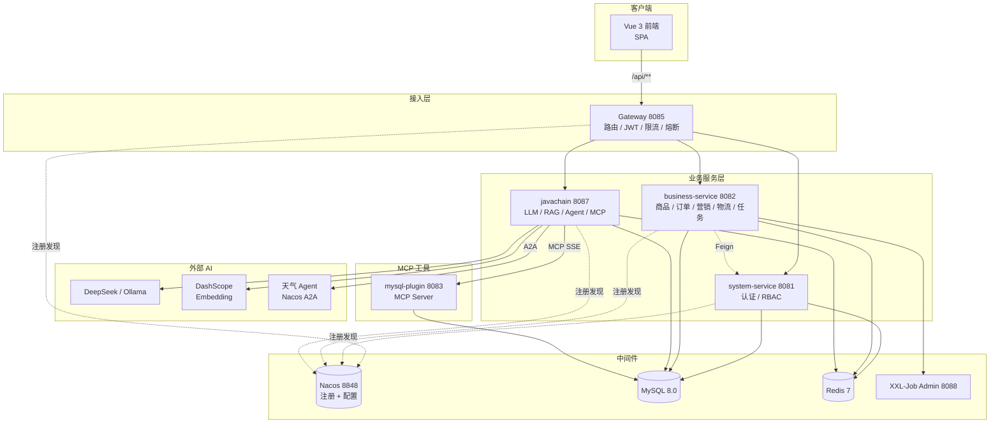
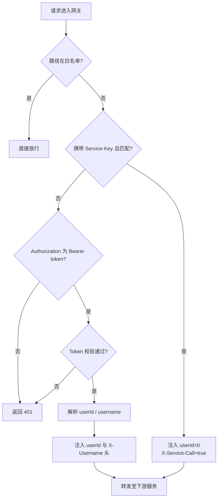
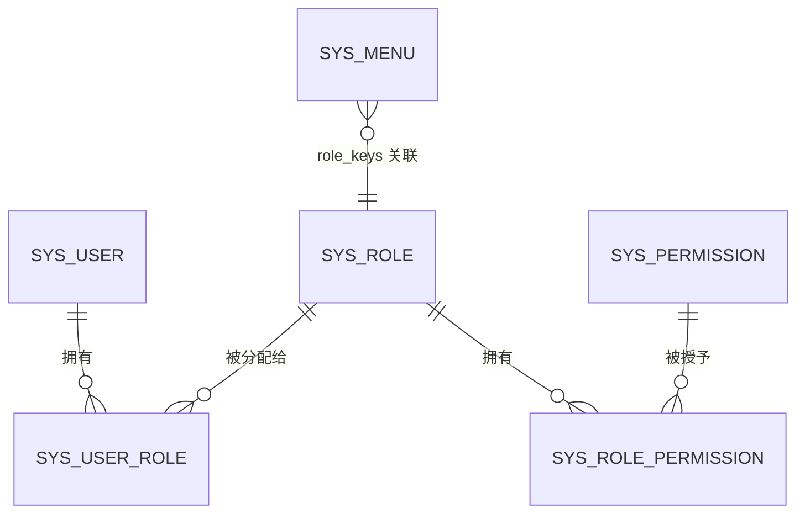
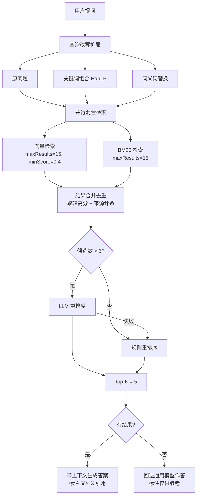
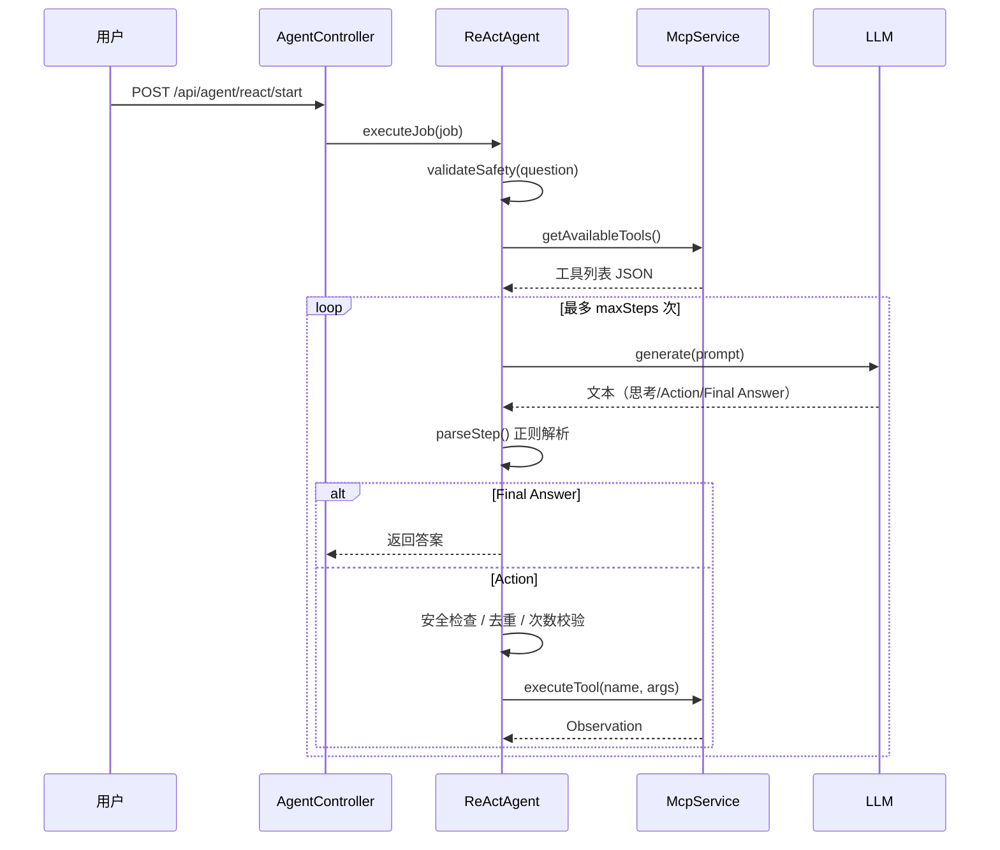
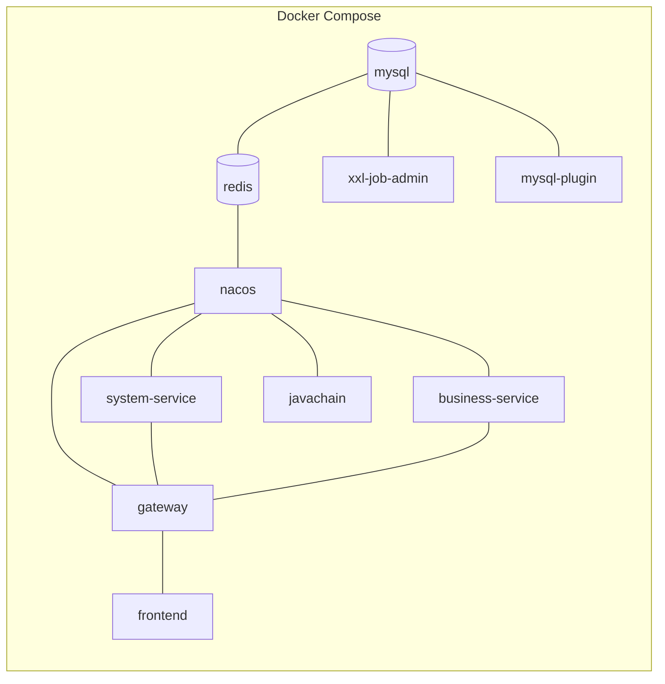

# 技术设计文档（TRD）

> 项目名称：OA 智能办公管理系统
> 文档版本：v1.2
> 最后更新：2026-10-06
> 适用对象：研发、架构、运维

---

## 1. 文档说明

本文档描述 OA 智能办公管理系统的技术架构、模块划分、关键技术方案与设计决策，作为研发实现与后续演进的依据。

配套文档：

- 产品需求：[PRD](../01-产品/PRD-产品需求文档.md)
- 接口定义：[API 接口文档](../03-接口/API-接口文档.md)
- 数据模型：[数据库设计文档](../04-数据库/数据库设计文档.md)

---

## 2. 技术栈总览

| 层级 | 技术 | 版本 |
| --- | --- | --- |
| 前端框架 | Vue | 3.5 |
| 前端构建 | Vite | 5.4 |
| 前端路由 | Vue Router | 4.4 |
| 前端状态 | Pinia | 2.2 |
| 前端 UI | Element Plus | 2.8 |
| HTTP 客户端 | Axios | 1.7 |
| Markdown 渲染 | markdown-it | 14.1 |
| 网关 | Spring Cloud Gateway | — |
| 后端框架 | Spring Boot | 3.4.1（javachain 为 3.3.1） |
| 微服务生态 | Spring Cloud | 2024.0.0 |
| 服务注册配置 | Spring Cloud Alibaba / Nacos | 2023.0.1.2 系 |
| 服务调用 | OpenFeign | — |
| 持久层 | MyBatis | 3.0.4 |
| 数据库 | MySQL | 8.0 |
| 缓存 | Redis | 7 |
| 认证 | JJWT | 0.12.6 |
| AI 编排 | LangChain4j | 0.35.0 |
| 大模型 | DeepSeek / Ollama / DashScope | — |
| 中文 NLP | HanLP | portable-1.8.4 |
| PDF 解析 | Apache PDFBox | 3.0.0 |
| 熔断限流 | Resilience4j | 2.2.0 |
| 任务调度 | XXL-Job | 2.4.1 |
| 构建 | Maven / npm | — |
| 运行时 | JDK | 21 |
| 容器 | Docker / Docker Compose | — |

### 2.1 版本关键约束

| 约束 | 说明 |
| --- | --- |
| JDK 21 | 所有 Java 服务强制要求，编译与运行均需 JDK 21 |
| javachain 独立版本 | javachain 使用 Spring Boot 3.3.1 且**无 parent**，与根工程 3.4.1 不同，不能共用依赖管理 |
| Nacos 3.x | Docker 中使用 `nacos/nacos-server:v3.2.2`，MCP 注册中心 API 为 v3 路径 |

---

## 3. 系统架构

### 3.1 整体架构



### 3.2 请求链路

**开发环境**：

```text
浏览器 → Vite Dev Server 5173（/api 代理） → Gateway 8085 → 微服务
```

**生产环境（Docker）**：

```text
浏览器 → Nginx 80（/api 反向代理，静态资源直出） → Gateway 8085 → 微服务
```

### 3.3 服务清单

| 服务 | 端口 | 技术栈 | 职责 |
| --- | --- | --- | --- |
| gateway | 8085 | Spring Cloud Gateway | 统一入口、路由、鉴权、限流、熔断 |
| system-service | 8081 | Spring Boot + Spring Security + MyBatis | 认证、用户、角色、权限、菜单 |
| business-service | 8082 | Spring Boot + MyBatis + XXL-Job | 商品、订单、营销、物流、看板、任务 |
| javachain | 8087 | Spring Boot + LangChain4j + WebFlux | LLM 对话、RAG、Agent、MCP、Skills |
| mysql-plugin | 8083 | MCP Server（独立项目） | 对外暴露 MySQL 查询工具 |
| oa-frontend | 5173 / 80 | Vue 3 + Vite + Nginx | 前端 SPA |
| Nacos | 8848 | — | 服务注册发现 + 配置中心 + MCP 注册中心 |
| XXL-Job Admin | 8088 | — | 分布式任务调度控制台 |
| MySQL | 3307→3306 | — | 业务数据库 |
| Redis | 6380→6379 | — | 缓存、会话、Token 黑名单 |

### 3.4 模块结构

#### 根 Maven 工程（`com.oa:oa-system`）

```text
java-backend/
├── pom.xml                 # 父 POM，聚合如下三个模块
├── gateway/                # 网关
├── system-service/         # 系统服务
└── business-service/       # 业务服务
```

#### javachain（独立工程）

```text
javachain/
├── pom.xml                 # 独立 POM，无 parent
└── src/main/java/com/example/javachain/
    ├── agent/              # ReAct Agent：ReActAgent / JobContext / ReasoningStep
    ├── common/             # ApiResult 统一返回
    ├── config/             # 各类配置：LLM / VectorStore / MCP / Redis / Agent
    ├── controller/         # Chat / Agent / Document 接口
    ├── model/              # ChatMessage
    ├── plugin/             # 插件元信息
    ├── security/           # 工具参数校验与安全审计
    ├── service/            # 对话 / RAG / MCP / 向量化 / 技能执行
    └── skill/              # 技能定义、解析、注册、意图识别
```

---

## 4. 网关设计

### 4.1 职责

| 能力 | 实现类 |
| --- | --- |
| 统一入口 | — |
| 服务路由 | `GatewayConfig` + `application.yml` routes |
| JWT 鉴权 | `JwtAuthenticationFilter`（GlobalFilter） |
| 限流 | `UserRateLimitFilter` + `SentinelGatewayConfig` |
| 异常处理 | `GlobalExceptionFilter` + `GlobalExceptionHandler` |
| 跨域 | CORS 配置 |

### 4.2 路由重写规则

**这是本项目最容易被忽略的细节**：三个服务的路径重写方式各不相同。

| 前端请求前缀 | 目标服务 | 过滤器 | 重写结果 |
| --- | --- | --- | --- |
| `/api/system/**` | `lb://system-service` | `RewritePath=/api/system/(?<remaining>.*), /system/${remaining}` | `/system/**` |
| `/api/business/**` | `lb://business-service` | `StripPrefix=1` | `/business/**` |
| `/api/javachain/**` | `lb://javachain` | `RewritePath=/api/javachain/(?<remaining>.*), /api/${remaining}` | `/api/**` |

**结论**：新增接口时必须匹配所属服务的 controller 前缀（system→`/system`、business→`/business`、javachain→`/api`），否则网关 404。

### 4.3 鉴权流程



**白名单**：`/api/system/auth/login`、`/api/system/auth/logout`、`/api/python/**`

**过滤器优先级**：`JwtAuthenticationFilter` order = `-2000000`（最先执行）。

### 4.4 关键契约：JWT 密钥一致性

`jwt.secret` 必须在这四处保持一致：

| 服务 | 配置位置 |
| --- | --- |
| gateway | `gateway/src/main/resources/application.yml` |
| system-service | `system-service/src/main/resources/application.yml` |
| business-service | `business-service/src/main/resources/application.yml` |
| javachain | `javachain/src/main/resources/application.yml` |

> ⚠️ 只改其中一处会导致鉴权静默失效——签发与校验密钥不匹配，表现为全部接口 401。

**签发与校验分工**：system-service 负责签发（`AuthService.login`），gateway 负责校验，下游服务信任网关注入的 `userId` / `X-Username` 头。

### 4.5 限流与熔断

| 配置项 | 值 | 说明 |
| --- | --- | --- |
| `gateway.sentinel.flow.business-service.count` | 50 | business-service 流控阈值 |
| `gateway.sentinel.flow.javachain-session-history.count` | 10 | javachain 会话历史接口流控 |
| `gateway.sentinel.flow.interval-sec` | 3 | 统计窗口 |
| `gateway.ratelimit.per-user.count` | 100 | 单用户限流次数 |
| `gateway.ratelimit.per-user.window-seconds` | 10 | 单用户限流窗口 |

---

## 5. 认证与授权设计

### 5.1 RBAC 模型



- **用户 ↔ 角色**：多对多，通过 `sys_user_role` 关联。
- **角色 ↔ 权限**：多对多，通过 `sys_role_permission` 关联。
- **菜单 ↔ 角色**：`sys_menu.role_keys` 字段存逗号分隔的角色标识，**不使用关联表**（历史表 `sys_role_menu` 已废弃并 DROP）。

### 5.2 认证实现要点

| 项 | 实现 |
| --- | --- |
| 密码存储 | BCrypt（`BCryptPasswordEncoder`） |
| Token 签发 | system-service `AuthService.login` |
| Token 校验 | gateway `JwtUtil.validateToken` |
| Token 过期 | gateway `jwt.expiration`（864000000ms ≈ 10 天），system-service 为 86400000ms（1 天） |
| 登出 | Token 加入 Redis 黑名单，由 `JwtBlacklistInterceptor` 校验 |
| 会话策略 | `SessionCreationPolicy.STATELESS`，无状态 |

> ⚠️ **注意**：gateway 与 system-service 的 `jwt.expiration` 配置不一致（10 天 vs 1 天）。实际有效期取决于签发方（system-service），gateway 仅校验签名有效性。

### 5.3 权限校验现状

`system-service` 的 `SecurityConfig` 配置为：

```java
.authorizeHttpRequests(auth -> auth.anyRequest().permitAll())
```

即**服务层不做过细的接口级鉴权**，权限控制依赖：

1. 网关的统一 JWT 校验（未登录拦截）
2. 前端菜单与按钮级控制（`src/directives/permission.js`）
3. `JwtBlacklistInterceptor`（登出后拦截）与 `PermissionCheckUtil`

> ⚠️ **安全提示**：这意味着只要持有有效 Token，任何登录用户都可调用 system-service 的全部接口。生产环境如需更细粒度控制，需补充接口级鉴权。

---

## 6. javachain AI 服务设计

这是系统中最复杂的模块，以下逐层说明。

### 6.1 配置设计

#### 配置加载链

`application.yml` 与 `bootstrap.yml` 均声明了 `spring.config.import`：

```yaml
spring:
  config:
    import:
      - optional:file:./.env[.properties]
      - optional:file:./javachain/.env[.properties]
      - optional:file:../.env[.properties]
      - optional:file:./application.yml
      - optional:file:./javachain/application.yml
      - optional:file:../application.yml
```

设计意图：允许在**仓库根目录**放一份 `.env`（已被 `.gitignore` 忽略），而 YAML 中仅保留默认值，实现"代码入库、密钥不入库"。

#### 大模型 Provider 切换

通过 `javachain.llm.provider` 切换（默认 `deepseek`）：

| Provider | 说明 | 关键配置 |
| --- | --- | --- |
| `deepseek` | 云端 API | `DEEPSEEK_API_KEY`、`DEEPSEEK_BASE_URL`、`chat-model` |
| `ollama` | 本地模型 | `OLLAMA_BASE_URL`、`OLLAMA_MODEL`、`temperature`、`timeout` |

**注意分工**：对话模型走上面配置；**向量化 Embedding 固定走 DashScope**（`text-embedding-v1`），由 `DASHSCOPE_API_KEY` 配置，与 chat provider 独立。

#### Agent 配置

`ReActAgentConfig`（前缀 `javachain.agent`）集中管理：

| 配置项 | 默认值 | 作用 |
| --- | --- | --- |
| `maxSteps` | 15 | 最大推理步数 |
| `maxToolCallsPerTool` | 3 | 单工具最大调用次数 |
| `timeoutMs` | 60000 | 整体超时 |
| `maxConsecutiveFailures` | 2 | 连续失败上限 |
| `retryCount` / `retryDelayMs` | 2 / 1000 | 工具调用重试 |
| `toolCacheExpireMs` | 300000 | 工具列表缓存时间 |
| `maxPromptTokens` | 8000 | 提示词 token 上限 |
| `summarizationThreshold` | 0.8 | 触发历史截断的比例 |
| `sensitiveKeywords` | 删除/drop/truncate/格式化… | 敏感词拦截 |
| `dangerousTools` | `filesystem_delete`、`filesystem_write` | 需人工确认的工具 |

> 注意：`AgentController.getStepInfo()` 返回的 safety 信息是**硬编码的描述文案**（maxSteps=10 等），与 `ReActAgentConfig` 的真实值不一致，属待修正项。

### 6.2 对话能力分层

| Service | 职责 |
| --- | --- |
| `ChatService` | 基础单轮对话 |
| `ChatHistoryService` | 会话创建、历史存储、清空、删除（Redis） |
| `IntelligentChatService` | 带历史的多轮对话 |
| `ToolAgentService` | 自动选择工具并执行 |
| `RagService` | RAG 检索问答 |

### 6.3 RAG 流程



**关键参数**（`RagService` 常量）：

| 参数 | 值 | 含义 |
| --- | --- | --- |
| `MAX_RESULTS` | 15 | 单路检索召回上限 |
| `MIN_SCORE` | 0.4 | 向量相似度最低阈值 |
| `FINAL_TOP_K` | 5 | 最终送入模型的上下文条数 |
| `PARALLEL_THREADS` | 4 | 并行检索线程数 |

**规则重排评分公式**：`综合分 = 向量分 × 0.5 + BM25分 × 0.4 + 来源奖励(0.1 × 来源数)`

**降级策略**：LLM 重排失败 → 规则重排；检索无结果 → 通用模型作答并标注来源。

### 6.4 ReAct Agent 设计

**实现方式**：**提示词驱动 + 正则解析**，而非依赖 Agent 框架。



**提示词模板要点**：

1. 动态注入工具列表（带 5 分钟缓存）
2. 强约束输出格式：`思考:` / `Action:` / `ActionInput:` / `Final Answer:`
3. 显式禁止规则：禁止重复调用同一工具、禁止循环调用、必须用工具获取信息、必须中文回答
4. 提供 few-shot 示例

**解析正则**：

| 字段 | 正则 |
| --- | --- |
| Thought | `思考[：:]\s*(.+?)(?=\n\s*Action|\n\s*Final|$)` |
| Action | `Action[：:]\s*(\w+)` |
| ActionInput | `ActionInput[：:]\s*(\{.+?\}|\{.*)` |
| Final Answer | `(?:Final Answer\|最终答案)[：:]\s*(.+)` |

**上下文管理**：`ReasoningContext` 累计每步的思考/行动/观察；当 token 估算超过 `maxPromptTokens × 0.8` 时，保留系统提示 + 最近 5 步，其余截断。

**结果有效性判断**（`isObservationUseful`）：观察结果为空、含错误关键词（失败/错误/exception/error/timeout 等）、JSON 中 `success=false` 或 `code != 200`、值为空数据，均判定为无效。

**性能指标**：`ReActAgent` 内置 `AtomicLong` 计数器统计总请求数、工具调用数、成功数、失败数、总耗时。

### 6.5 工具（MCP）设计

`McpService` 提供**双通道**工具能力：

```mermaid
flowchart TD
    A[executeTool(name, args)] --> B{本地工具有匹配?}
    B -->|是| C[反射调用 SkillService 上<br/>@Tool 注解方法]
    B -->|否| D[Nacos 服务发现<br/>查找 MCP Server]
    D --> E[建立 SSE 连接]
    E --> F[initialize 握手]
    F --> G[tools/call 请求]
    G --> H[解析 SSE 响应]
    H --> I[提取 content 返回]
    B -.无结果.-> J[回退 fallback-base-url<br/>默认 127.0.0.1:8083]
```

#### 通道一：本地工具

定义在 `SkillService`，用 LangChain4j 的 `@Tool` 注解标记：

| 工具 | 说明 |
| --- | --- |
| `getCurrentTime` | 获取当前系统时间 |
| `formatTimestamp` | 时间戳格式化 |
| `generateRandomNumber` | 生成指定范围随机数 |
| `generateUUID` | 生成 UUID |
| `queryKnowledgeBase` | 查询知识库 |
| `getCurrentUserFromToken` | 从 JWT 解析当前用户 |

`McpService` 通过**反射**扫描 `SkillService` 的方法，读取 `@Tool` 注解、从方法参数类型生成 JSON Schema，并直接反射调用。

#### 通道二：远程 MCP 工具

- **服务发现**：`McpServiceDiscoverer` 调用 Nacos MCP Registry API `/nacos/v3/admin/ai/mcp/list` 查询已注册的 MCP Server。
- **协议**：MCP over SSE，JSON-RPC 2.0。完整交互序列：

```text
GET  {sseEndpoint}        → 建立 SSE 连接，收到 event: endpoint
POST {messageUrl}         → initialize（protocolVersion 2024-11-05）
POST {messageUrl}         → notifications/initialized
POST {messageUrl}         → tools/list 或 tools/call
GET  SSE 流               → 读取对应 id 的响应
```

- **超时**：连接 5s，读取 20s。
- **回退**：Nacos 未发现目标服务时，使用 `mcp.fallback-base-url`（默认 `http://127.0.0.1:8083`，即 mysql-plugin）。
- **工具名匹配**：对下划线和连字符做归一化，并尝试 snake_case ↔ camelCase 互转。

### 6.6 Skills 设计

**加载机制**：`SkillRegistry` 在 `@PostConstruct` 时按 `skill.pattern`（默认 `.trae/skills/*/SKILL.md`）扫描，用 `SkillParser` 解析为 `SkillDefinition`（含触发词、步骤、工具），并按**名称**和**触发词**双索引注册。

**构建打包**：javachain 的 `pom.xml` 中有特殊 `<resources>` 配置，`<include>**/*</include>` 与 `<include>**/.*</include>` 确保 `.trae/` 这类**点号开头的隐藏目录**也被打包进 jar。

**运行时能力**：支持技能列表查询、重载（热更新）、按指定技能执行、自动识别意图匹配技能。

**新增技能**：在 `javachain/src/main/resources/.trae/skills/<技能名>/SKILL.md` 下新增文件即可。

### 6.7 向量存储

`VectorStoreConfig` 提供 `EmbeddingStore<TextSegment>` Bean，当前 `vector-store.type: memory`。

| 特性 | 说明 |
| --- | --- |
| 实现 | 内存向量库 |
| 优点 | 无需外部依赖，启动即可用 |
| **缺点** | **重启即丢失，需重新向量化** |

要持久化，需替换 `VectorStoreConfig` 中的 `EmbeddingStore` Bean（如接入 Redis / Milvus / pgvector 等）。

### 6.8 熔断设计

`resilience4j` 配置（`aiService` 实例）：

| 参数 | 值 |
| --- | --- |
| 失败率阈值 | 50% |
| 慢调用率阈值 | 50% |
| 慢调用判定 | 10s |
| 滑动窗口 | COUNT_BASED，10 次 |
| 最小调用次数 | 5 |
| 熔断持续 | 30s |
| 半开允许调用 | 3 |

状态机：`Closed → Open → HalfOpen → Closed`，到达等待时间自动进入半开。

---

## 7. business-service 设计

### 7.1 分层结构

```text
controller → service / service.impl → mapper → MySQL
                 ↓
              entity / dto / vo
```

### 7.2 横切关注点

| 能力 | 实现 |
| --- | --- |
| 统一返回 | `common.Result<T>`（code / message / data） |
| 接口日志 | `aspect.ApiLog` 注解 + `ApiLogAspect` 切面 |
| JWT 解析 | `util.JwtUtil` |
| 跨域 | `config.WebConfig`（`allowedOriginPatterns("*")`） |
| 服务调用 | `feign.SystemServiceFeign` |

### 7.3 定时任务（XXL-Job）

| 组件 | 说明 |
| --- | --- |
| `XxlJobConfig` | 执行器配置，端口 9999 |
| `DemoJobHandler` | 示例任务处理器 |
| `TodoTaskJob` | 待办任务处理器 |
| `JobRegistryService` | 任务注册 |
| `JobController` | 任务管理接口（列表 / 启停 / 触发 / 日志） |

> ⚠️ **现状说明**：`JobController` 当前返回的是**硬编码的演示数据**，尚未真正调用 XXL-Job Admin 的 REST API。接入真实调度管理的代码有待补齐。

### 7.4 外部集成

| 集成 | 相关类 | 状态 |
| --- | --- | --- |
| 微信支付 | `WechatPayService` / `WechatPayUtil` / `WechatPayConfig` | 服务层已实现，配置为占位值 |
| 快递查询 | `ExpressQueryService` / `SfExpressQueryServiceImpl` | 已实现顺丰查询，可扩展其他快递公司 |
| 系统服务调用 | `SystemServiceFeign` | 可用，默认 `http://localhost:8081` |

**快递查询扩展方式**：实现 `ExpressQueryService` 接口，提供 `getCompanyCode()` 与 `queryTracking()`，Spring 会自动注入到 `ExpressController` 的 `List<ExpressQueryService>` 中，按快递公司编码路由。

---

## 8. system-service 设计

### 8.1 模块职责

| Controller | 职责 |
| --- | --- |
| `AuthController` | 登录、登出、当前用户、当前用户菜单 |
| `UserController` | 用户 CRUD、分配角色 |
| `RoleController` | 角色 CRUD、分配权限、权限树 |
| `PermissionController` | 权限 CRUD、权限树、菜单权限 |
| `MenuController` | 菜单 CRUD、菜单树、按角色查询 |
| `DashboardController` | 系统看板统计 |

### 8.2 关键实现

| 项 | 说明 |
| --- | --- |
| 密码加密 | `BCryptPasswordEncoder` |
| 安全配置 | `SecurityConfig`：关闭 CSRF、无状态会话、**permitAll** |
| 登出拦截 | `JwtBlacklistInterceptor` 基于 Redis 黑名单 |
| 权限工具 | `PermissionCheckUtil` |
| 用户信息获取 | 从网关注入的 `X-Username` 头读取用户名 |
| MyBatis 映射 | `src/main/resources/mapper/*.xml` |

---

## 9. 前端设计

### 9.1 目录结构

```text
oa-frontend/
├── src/
│   ├── api/            # 按业务域拆分的接口封装
│   ├── directives/     # permission.js 权限指令
│   ├── router/         # index.js 路由 + 全局守卫
│   ├── stores/         # user.js（Pinia）
│   ├── utils/          # request.js（Axios 封装）
│   ├── views/          # 页面组件
│   ├── App.vue
│   └── main.js
├── vite.config.js      # @ 别名 + /api 代理到 8085
├── nginx.conf          # 生产反代配置
└── Dockerfile          # 多阶段构建
```

### 9.2 请求封装（`utils/request.js`）

| 机制 | 行为 |
| --- | --- |
| baseURL | `/api` |
| 超时 | 10s |
| 请求拦截 | 自动附加 `Authorization: Bearer <token>` |
| 响应拦截 | `code !== 200` 视为错误并提示 |
| 401 | 清除 Token，提示"登录已过期"，跳转 `/login` |
| 403 | 提示"没有权限访问该资源" |
| 502 / 503 / 超时 | 跳转 `/maintenance` 维护页 |

### 9.3 路由守卫

1. 无 Token 且访问非登录页 → 跳转 `/login`
2. 有 Token 且访问登录页 → 跳转首页
3. 有 Token 但无用户信息 → 拉取用户信息
4. 根据用户菜单校验路径可访问性

第 4 条的判定规则：

- 以 `/system/auth/menu` 返回的菜单树路径集合为白名单，用户访问不在其中的页面时重定向到 `/dashboard`；
- **豁免路径** `/login`、`/maintenance`、`/dashboard` —— 其中 `/dashboard` 是重定向目标，必须始终可达，否则「用户菜单不含首页」时会形成无限重定向；
- 菜单为空数组（后端异常）时**不拦截**，避免菜单异常导致全站不可用；
- 页面必须与 `sys_menu.path` 一一对应，否则会被误拦。当前 `sys_menu` 中的路径与 `router/index.js` 的路由已对齐（含 `/business/logistics`）。

### 9.4 构建与部署

- **构建**：`npm run build` → 输出 `dist/`
- **Docker 多阶段构建**：`node:20-alpine` 构建 → `nginx:1.27-alpine` 运行
- **Nginx 配置要点**：
  - `try_files $uri $uri/ /index.html` 支持 SPA 前端路由
  - `/api/` 反向代理到 `gateway:8085`（使用 Docker 内置 DNS `127.0.0.11` 动态解析）
  - `error_page 502 503 /maintenance.html` 后端不可用时展示维护页

---

## 10. 数据设计概要

详见 [数据库设计文档](../04-数据库/数据库设计文档.md)。要点：

| 项 | 设计 |
| --- | --- |
| 数据库 | `example_db`，字符集 `utf8mb4` / `utf8mb4_unicode_ci` |
| 表前缀 | 系统表 `sys_`，业务表部分无前缀（`marketing`） |
| 主键 | 统一 `bigint` 自增 `id` |
| 审计字段 | `create_by` / `create_time` / `update_by` / `update_time` / `remark` |
| 逻辑删除 | **未使用**，均为物理删除 |
| 外键 | **未建立**物理外键，关联由应用层保证 |
| 索引 | 唯一索引（如 `username`、`category_code`）与普通索引（如 `idx_order_id`） |

---

## 11. 部署架构

详见 [运维部署手册](../05-运维/部署运维手册.md)。要点：



**启动顺序**（由 `depends_on` + healthcheck 保证）：

```text
mysql(healthy) → redis → nacos(healthy) → xxl-job-admin
    → system-service / business-service / mysql-plugin
    → gateway(healthy) → frontend
```

**端口映射原则**：容器内保持标准端口，宿主机做偏移映射以避免冲突（MySQL 3307、Redis 6380、XXL-Job 8088）。

---

## 12. 技术决策记录（ADR）

| 编号 | 决策 | 理由 | 代价 |
| --- | --- | --- | --- |
| ADR-01 | javachain 独立为单独 Maven 工程 | AI 依赖（LangChain4j 等）与业务服务差异大，避免污染根工程依赖树 | 构建需两步，版本管理分散 |
| ADR-02 | Agent 采用提示词 + 正则解析，而非 Agent 框架 | 行为可控、便于调试、Prompt 可随时调整 | 依赖模型遵循格式能力，解析较脆弱 |
| ADR-03 | 菜单与角色用 `role_keys` 字段而非关联表 | 简化查询，菜单层级不深 | 不符合范式，字符串匹配效率低 |
| ADR-04 | 向量库使用内存实现 | 降低本地与演示环境部署门槛 | 数据不持久，生产不可用 |
| ADR-05 | 鉴权集中在网关，服务层 permitAll | 实现简单，避免重复鉴权逻辑 | 内网直连服务可绕过鉴权 |
| ADR-06 | 各服务复制 `Result` / `JwtUtil` 等类 | 避免引入公共库模块，服务独立演进 | 代码重复，修改需多处同步 |
| ADR-07 | 前端用 Nginx 反代而非直连网关 | 统一域名、静态资源加速、便于加维护页 | 多一层代理 |

---

## 13. 已知技术债

| 项 | 位置 | 建议 |
| --- | --- | --- |
| 明文密钥入库 | 各 `application.yml`、`.env`、`docker-compose.yml` | 迁移至环境变量或密钥管理服务，清理 git 历史 |
| `.env` 已提交 | 根目录 | 确认 Git 历史，必要时重写 |
| 向量库不持久 | `VectorStoreConfig` | 接入持久化向量库 |
| Agent 任务不持久 | `JobContext` 内存 | 引入 Redis/DB 存储 |
| 定时任务为演示数据 | `JobController` | 对接 XXL-Job Admin 真实 API |
| 硬编码文件目录 | `ChatController.vectorizeFiles` 中的 `D:\agentDemo\...` | 改为配置项 |
| 过期时间不一致 | gateway 10 天 vs system-service 1 天 | 统一配置 |
| safety 描述与真实配置不符 | `AgentController.getStepInfo` | 从 `ReActAgentConfig` 读取真实值 |
| 服务层无接口级鉴权 | `system-service/SecurityConfig` | 按需补充方法级权限校验 |
| 分页在内存中实现 | 各 Controller 的 `subList` | 大数据量下改由 SQL `LIMIT` 分页 |
| 插件只登记元信息 | `PluginGovernanceService.loadPlugin` | 尚未实现插件类动态加载与工具自动注册 |
| Skill 声明的工具需自行注册 | `.trae/skills/*/SKILL.md` 中的 `使用工具` 声明 | 声明的工具必须是本地 `@Tool` 方法或 Nacos MCP Registry 中的远端工具，否则执行时报 `Tool not found` |

---

## 14. 附录

### 14.1 关键文件索引

| 关注点 | 文件 |
| --- | --- |
| 网关路由 | `gateway/src/main/resources/application.yml` |
| 网关鉴权 | `gateway/src/main/java/com/oa/gateway/filter/JwtAuthenticationFilter.java` |
| 登录签发 | `system-service/src/main/java/com/oa/system/service/impl/AuthServiceImpl.java` |
| Agent 核心 | `javachain/src/main/java/com/example/javachain/agent/ReActAgent.java` |
| Agent 配置 | `javachain/src/main/java/com/example/javachain/config/ReActAgentConfig.java` |
| MCP 服务 | `javachain/src/main/java/com/example/javachain/service/McpService.java` |
| RAG 服务 | `javachain/src/main/java/com/example/javachain/service/RagService.java` |
| 技能注册 | `javachain/src/main/java/com/example/javachain/skill/SkillRegistry.java` |
| 技能解析 | `javachain/src/main/java/com/example/javachain/skill/SkillParser.java` |
| 技能执行 | `javachain/src/main/java/com/example/javachain/service/SkillExecutionService.java` |
| 插件治理 | `javachain/src/main/java/com/example/javachain/service/PluginGovernanceService.java` |
| 分页工具 | `system-service`、`business-service` 各自的 `common/PageUtils.java` |
| 本地工具 | `javachain/src/main/java/com/example/javachain/service/SkillService.java` |
| 前端请求封装 | `oa-frontend/src/utils/request.js` |
| 前端路由 | `oa-frontend/src/router/index.js` |
| 编排配置 | `docker-compose.yml` |

### 14.2 参考

- [Spring Cloud Gateway 文档](https://docs.spring.io/spring-cloud-gateway/reference/)
- [LangChain4j 文档](https://docs.langchain4j.dev/)
- [Nacos MCP Registry](https://nacos.io/)
- [XXL-Job 文档](https://www.xuxueli.com/xxl-job/)

---

## 变更记录

| 版本 | 日期 | 变更内容 | 关联 Issue | 修改人 |
| --- | --- | --- | --- | --- |
| v1.2 | 2026-10-06 | 细化 §9.3 路由守卫判定规则；技术债补充「插件只登记元信息」「Skill 工具需自行注册」；关键文件索引补充技能执行与插件治理 | — | — |
| v1.1 | 2026-10-06 | 目录结构代码块补充 `text` 语言标注（符合文档编写规范） | — | — |
| v1.0 | 2026-10-04 | 初版，覆盖架构、网关、鉴权、javachain AI 能力与 7 项 ADR | — | — |
