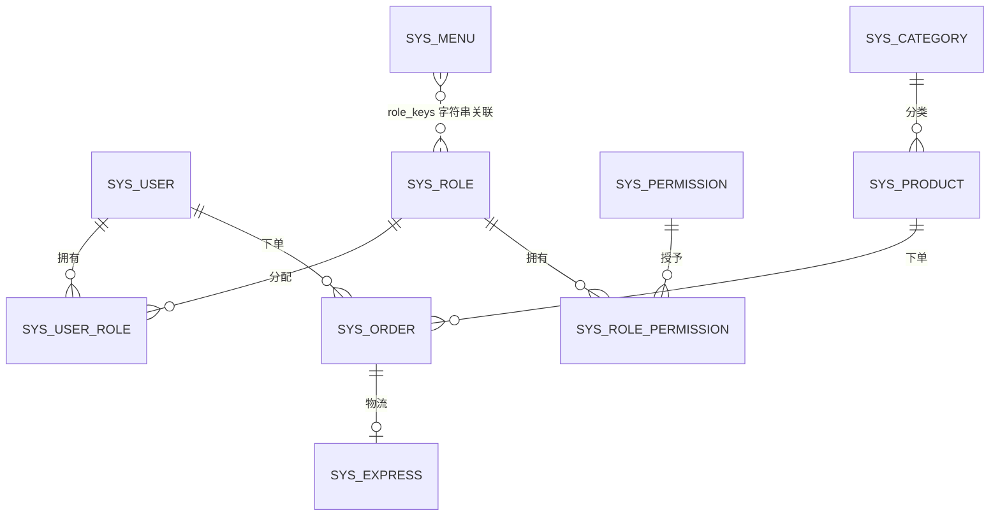

# 数据库设计文档

> 项目名称：OA 智能办公管理系统
> 文档版本：v1.0
> 最后更新：2026-10-04
> 适用对象：后端研发、DBA、测试

---

## 1. 概述

### 1.1 数据库信息

| 项 | 值 |
| --- | --- |
| 数据库名 | `example_db` |
| 字符集 | `utf8mb4` |
| 排序规则 | `utf8mb4_unicode_ci` |
| 存储引擎 | InnoDB |
| 时区 | `+08:00`（Asia/Shanghai） |
| MySQL 版本 | 8.0 |

XXL-Job Admin 使用**独立数据库** `xxl_job`，由 `sql/xxl_job.sql` 初始化。

### 1.2 初始化脚本

| 文件 | 作用 | Docker 自动执行 |
| --- | --- | --- |
| `sql/init.sql` | 业务库完整初始化（建库、建表、初始数据） | 是 |
| `sql/xxl_job.sql` | XXL-Job Admin 库表与默认数据 | 是 |
| `sql/migration_express.sql` | 物流模块增量迁移（新增 `sys_express` 表与菜单） | 否，需手动执行 |

**执行顺序**：`init.sql` → `xxl_job.sql`（`migration_express.sql` 仅对已有旧库升级时使用）。

> ⚠️ **重要**：`init.sql` 包含 `DROP TABLE` 语句，手动执行会**清空并重建**所有业务表。Docker 环境下的 init 脚本**仅在数据卷为空时首次启动执行**，重新初始化需先 `docker compose down -v`。

### 1.3 命名与设计约定

| 约定 | 说明 |
| --- | --- |
| 表命名 | 系统表前缀 `sys_`；部分业务表无前缀（如 `marketing`、`sys_express` 例外） |
| 主键 | 统一 `id bigint AUTO_INCREMENT` |
| 字段命名 | 下划线命名（`snake_case`），MyBatis 开启驼峰映射 |
| 审计字段 | `create_by`、`create_time`、`update_by`、`update_time`、`remark` |
| 状态字段 | `status`，`int`/`tinyint`，0 禁用 / 1 启用（部分表语义不同） |
| 逻辑删除 | **未使用**，删除均为物理删除 |
| 外键约束 | **未建立**，关联关系由应用层维护 |
| 注释 | 所有表与字段均有 `COMMENT` |

---

## 2. ER 关系图



> 说明：`sys_role_menu` 为历史遗留表，已在 `init.sql` 中 `DROP`，菜单与角色的关系改由 `sys_menu.role_keys` 字段维护（逗号分隔的角色标识）。

---

## 3. 表结构详情

### 3.1 sys_user（用户表）

| 字段 | 类型 | 允许空 | 默认值 | 说明 |
| --- | --- | --- | --- | --- |
| `id` | bigint | 否 | AUTO_INCREMENT | 用户 ID，主键 |
| `username` | varchar(50) | 否 | — | 登录账号，**唯一** |
| `password` | varchar(255) | 否 | — | 登录密码（BCrypt 密文） |
| `email` | varchar(100) | 是 | NULL | 邮箱 |
| `phone` | varchar(20) | 是 | NULL | 手机号 |
| `real_name` | varchar(50) | 是 | NULL | 真实姓名 |
| `avatar` | varchar(255) | 是 | NULL | 头像地址 |
| `status` | int | 否 | — | 0 禁用、1 启用 |
| `create_by` | bigint | 否 | — | 创建人 ID |
| `create_time` | datetime | 否 | — | 创建时间 |
| `update_by` | bigint | 是 | NULL | 更新人 ID |
| `update_time` | datetime | 是 | NULL | 更新时间 |
| `remark` | varchar(500) | 是 | NULL | 备注 |

**索引**：

| 名称 | 类型 | 字段 |
| --- | --- | --- |
| PRIMARY | 主键 | `id` |
| `uc_sys_user_username` | 唯一 | `username` |

**初始数据**：

| id | username | real_name | status | 说明 |
| --- | --- | --- | --- | --- |
| 1 | admin | 张三 | 1 | 管理员账号 |
| 2 | test | 李四 | 1 | 测试账号 |
| 3 | wang | 王五 | 1 | 普通账号 |

> 初始密码均为 BCrypt 密文，**具体明文需向项目维护者确认**。

---

### 3.2 sys_role（角色表）

| 字段 | 类型 | 允许空 | 说明 |
| --- | --- | --- | --- |
| `id` | bigint | 否 | 角色 ID，主键 |
| `role_name` | varchar(50) | 否 | 角色名称 |
| `role_key` | varchar(100) | 否 | 角色标识（如 admin / user） |
| `description` | varchar(255) | 是 | 角色描述 |
| `status` | int | 否 | 0 禁用、1 启用 |
| `create_by` | bigint | 否 | 创建人 ID |
| `create_time` | datetime | 否 | 创建时间 |
| `update_by` | bigint | 是 | 更新人 ID |
| `update_time` | datetime | 是 | 更新时间 |
| `remark` | varchar(500) | 是 | 备注 |

**索引**：PRIMARY (`id`)

**初始数据**：

| id | role_name | role_key | description |
| --- | --- | --- | --- |
| 1 | 管理员 | admin | 可以查看所有权限 |
| 2 | vip用户 | user | 普通用户 |

> **注意**：`sys_menu.role_keys` 中存储的是 `role_key`（如 `admin`、`user`），而非 `role_name`。

---

### 3.3 sys_permission（权限表）

| 字段 | 类型 | 允许空 | 说明 |
| --- | --- | --- | --- |
| `id` | bigint | 否 | 权限 ID，主键 |
| `permission_name` | varchar(50) | 否 | 权限名称 |
| `permission_key` | varchar(100) | 否 | 权限标识（如 `role:manage`） |
| `resource_type` | varchar(50) | 是 | 资源类型 |
| `path` | varchar(100) | 是 | 资源路径 |
| `component` | varchar(100) | 是 | 前端组件 |
| `parent_id` | bigint | 是 | 父级权限 ID |
| `order_num` | int | 否 | 排序 |
| `status` | int | 否 | 0 禁用、1 启用 |
| `create_by` | bigint | 否 | 创建人 ID |
| `create_time` | datetime | 否 | 创建时间 |
| `update_by` | bigint | 是 | 更新人 ID |
| `update_time` | datetime | 是 | 更新时间 |
| `remark` | varchar(500) | 是 | 备注 |

**索引**：PRIMARY (`id`)

**初始数据**：

| id | permission_name | permission_key | resource_type |
| --- | --- | --- | --- |
| 6 | 普通用户 | user | menu |
| 7 | 超级用户 | admin | menu |

---

### 3.4 sys_menu（菜单表）

| 字段 | 类型 | 允许空 | 默认值 | 说明 |
| --- | --- | --- | --- | --- |
| `id` | bigint | 否 | AUTO_INCREMENT | 菜单 ID，主键 |
| `menu_name` | varchar(100) | 否 | — | 菜单名称 |
| `path` | varchar(255) | 是 | NULL | 路由路径 |
| `component` | varchar(255) | 是 | NULL | 前端组件路径 |
| `icon` | varchar(100) | 是 | NULL | 菜单图标 |
| `parent_id` | bigint | 是 | 0 | 父级菜单 ID |
| `order_num` | int | 否 | 0 | 排序 |
| `role_keys` | varchar(500) | 是 | NULL | **可访问角色标识，逗号分隔** |
| `status` | int | 否 | 1 | 0 禁用、1 启用 |
| `create_by` | varchar(50) | 否 | — | 创建人（**字符串类型**，与其他表不同） |
| `create_time` | datetime | 否 | — | 创建时间 |
| `update_by` | varchar(50) | 是 | NULL | 更新人（**字符串类型**） |
| `update_time` | datetime | 是 | NULL | 更新时间 |
| `remark` | varchar(500) | 是 | NULL | 备注 |

**索引**：PRIMARY (`id`)

**设计要点**：

1. `role_keys` 是**逗号分隔的字符串**，如 `admin,user`，应用层做字符串包含匹配。
2. `create_by` / `update_by` 为 **varchar(50)**，与其他表的 `bigint` 不一致。
3. `parent_id` 为 NULL 表示顶级菜单。

**初始数据（完整菜单树）**：

| id | menu_name | path | parent_id | order_num | role_keys |
| --- | --- | --- | --- | --- | --- |
| 1 | 首页 | `/dashboard` | NULL | 1 | admin |
| 2 | 系统管理 | `/system` | NULL | 2 | admin |
| 3 | 用户管理 | `/system/users` | 2 | 1 | admin |
| 4 | 角色管理 | `/system/roles` | 2 | 2 | admin |
| 5 | 权限管理 | `/system/permissions` | 2 | 3 | admin |
| 6 | 菜单管理 | `/system/menus` | 2 | 4 | admin |
| 7 | 业务管理 | `/business` | NULL | 3 | admin,user |
| 8 | 商品管理 | `/business/products` | 7 | 1 | admin,user |
| 9 | 订单管理 | `/business/orders` | 7 | 2 | admin,user |
| 10 | 营销推广 | `/business/marketing` | 7 | 3 | admin,user |
| 11 | 知识百科智能 | `/business/chat` | 7 | 4 | admin,user |
| 12 | 公司业务助手 | `/business/knowledge` | 7 | 5 | admin,user |
| 13 | 智能体 | `/business/javachain` | 7 | 6 | admin,user |
| 14 | 物流管理 | `/business/logistics` | 7 | 7 | admin,user |

> 菜单 id 14（物流管理）由 `migration_express.sql` 补充插入。

---

### 3.5 sys_user_role（用户角色关系表）

| 字段 | 类型 | 允许空 | 说明 |
| --- | --- | --- | --- |
| `id` | bigint | 否 | 关系 ID，主键 |
| `user_id` | bigint | 否 | 用户 ID |
| `role_id` | bigint | 否 | 角色 ID |
| `create_by` | bigint | 否 | 创建人 ID |
| `create_time` | datetime | 否 | 创建时间 |

**索引**：PRIMARY (`id`)

**初始数据**：

| id | user_id | role_id |
| --- | --- | --- |
| 1 | 1 | 1 |
| 3 | 2 | 2 |
| 4 | 3 | 2 |

> `user_id` 与 `role_id` **未建唯一索引**，理论上可重复插入。

---

### 3.6 sys_role_permission（角色权限关系表）

| 字段 | 类型 | 允许空 | 说明 |
| --- | --- | --- | --- |
| `id` | bigint | 否 | 关系 ID，主键 |
| `role_id` | bigint | 否 | 角色 ID |
| `permission_id` | bigint | 否 | 权限 ID |
| `create_by` | bigint | 否 | 创建人 ID |
| `create_time` | datetime | 否 | 创建时间 |

**索引**：PRIMARY (`id`)

**初始数据**：管理员角色（role_id=1）拥有全部权限（6、7）；vip 用户（role_id=2）拥有权限 6。

---

### 3.7 sys_category（商品分类表）

| 字段 | 类型 | 允许空 | 默认值 | 说明 |
| --- | --- | --- | --- | --- |
| `id` | bigint | 否 | AUTO_INCREMENT | 分类 ID，主键 |
| `category_name` | varchar(100) | 否 | — | 分类名称 |
| `category_code` | varchar(100) | 否 | — | 分类编码，**唯一** |
| `sort` | int | 是 | 0 | 排序 |
| `status` | tinyint | 是 | 1 | 0 禁用、1 启用 |
| `parent_id` | bigint | 是 | NULL | 父级分类 ID |
| `remark` | varchar(500) | 是 | NULL | 备注 |
| `create_by` | bigint | 是 | NULL | 创建人 |
| `create_time` | datetime | 是 | NULL | 创建时间 |
| `update_by` | bigint | 是 | NULL | 更新人 |
| `update_time` | datetime | 是 | NULL | 更新时间 |

**索引**：

| 名称 | 类型 | 字段 |
| --- | --- | --- |
| PRIMARY | 主键 | `id` |
| `category_code` | 唯一 | `category_code` |

**初始数据**：衣着类（1001）、酒类（2001）、水果（3001）。

---

### 3.8 sys_product（商品表）

| 字段 | 类型 | 允许空 | 说明 |
| --- | --- | --- | --- |
| `id` | bigint | 否 | 商品 ID，主键 |
| `product_name` | varchar(100) | 否 | 商品名称 |
| `product_code` | varchar(50) | 是 | 商品编码 |
| `category` | varchar(50) | 是 | 商品分类（**存分类名称，非 ID**） |
| `price` | decimal(10,2) | 是 | 商品价格 |
| `stock` | int | 是 | 库存数量 |
| `description` | varchar(500) | 是 | 商品描述 |
| `image_url` | varchar(255) | 是 | 商品图片地址 |
| `status` | int | 否 | 0 禁用、1 启用 |
| `create_by` | bigint | 否 | 创建人 ID |
| `create_time` | datetime | 否 | 创建时间 |
| `update_by` | bigint | 是 | 更新人 ID |
| `update_time` | datetime | 是 | 更新时间 |
| `remark` | varchar(500) | 是 | 备注 |

**索引**：PRIMARY (`id`)

**设计说明**：`category` 字段**直接存储分类名称字符串**（如"酒类"），而非 `sys_category.id`。这是一个**反范式设计**，代价是分类改名后需同步更新商品数据。

**初始数据（节选）**：

| id | product_name | category | price | stock |
| --- | --- | --- | --- | --- |
| 1 | 鞋子 | 衣着类 | 7.00 | 10 |
| 2 | 外套 | 酒类 | 4.00 | 15 |
| 3 | 青岛啤酒 | 酒类 | 12.00 | 1215 |
| 4 | 百威 | 酒类 | 5.00 | 1168 |
| 6 | 香蕉 | 水果 | 2.00 | 49999 |

---

### 3.9 sys_order（订单表）

| 字段 | 类型 | 允许空 | 默认值 | 说明 |
| --- | --- | --- | --- | --- |
| `id` | bigint | 否 | AUTO_INCREMENT | 订单 ID，主键 |
| `order_no` | varchar(50) | 否 | — | 订单编号 |
| `user_id` | bigint | 是 | NULL | 下单用户 ID |
| `product_id` | bigint | 是 | NULL | 商品 ID |
| `product_name` | varchar(100) | 是 | NULL | **商品名称快照** |
| `quantity` | int | 是 | 1 | 购买数量 |
| `unit_price` | decimal(10,2) | 是 | NULL | 商品单价 |
| `total_amount` | decimal(10,2) | 是 | NULL | 订单总金额 |
| `status` | int | 是 | 1 | 订单状态 |
| `shipping_address` | text | 是 | NULL | 收货地址 |
| `receiver_name` | varchar(50) | 是 | NULL | 收货人姓名 |
| `receiver_phone` | varchar(20) | 是 | NULL | 收货人手机号 |
| `remark` | varchar(500) | 是 | NULL | 备注 |
| `create_by` | bigint | 是 | NULL | 创建人 ID |
| `create_time` | datetime | 是 | NULL | 创建时间 |
| `update_by` | bigint | 是 | NULL | 更新人 ID |
| `update_time` | datetime | 是 | NULL | 更新时间 |

**索引**：PRIMARY (`id`)

**设计说明**：`product_name` 与 `unit_price` 是**下单时的快照数据**，商品后续改价或改名不影响历史订单，这是正确的电商设计实践。

**订单状态取值**（代码中**无枚举定义**，依据实际数据推断）：

| 值 | 推断含义 |
| --- | --- |
| 1 | 待处理 / 新建 |
| 2 | 处理中 |
| 3 | 已完成 |
| 4 | 已发货 |
| 7 | 异常 / 取消 |
| 8 | 已收货 |

> ⚠️ **待改进**：订单状态缺少枚举类定义，建议补充 `OrderStatusEnum` 并统一前端字典。

---

### 3.10 sys_express（物流信息表）

| 字段 | 类型 | 允许空 | 默认值 | 说明 |
| --- | --- | --- | --- | --- |
| `id` | bigint | 否 | AUTO_INCREMENT | 物流 ID，主键 |
| `order_id` | bigint | 否 | — | 订单 ID |
| `order_no` | varchar(50) | 否 | — | 订单编号 |
| `express_company` | varchar(50) | 否 | — | 快递公司 |
| `express_no` | varchar(100) | 否 | — | 运单号 |
| `status` | tinyint | 否 | 0 | 0 已揽收、1 运输中、2 派送中、3 已签收、4 异常 |
| `tracking_nodes` | json | 是 | NULL | 物流轨迹节点 JSON |
| `sender_name` | varchar(50) | 是 | NULL | 发件人 |
| `sender_phone` | varchar(20) | 是 | NULL | 发件人电话 |
| `sender_address` | varchar(255) | 是 | NULL | 发件地址 |
| `remark` | varchar(500) | 是 | NULL | 备注 |
| `create_by` | bigint | 是 | NULL | 创建人 ID |
| `create_time` | datetime | 是 | NULL | 创建时间 |
| `update_by` | bigint | 是 | NULL | 更新人 ID |
| `update_time` | datetime | 是 | NULL | 更新时间 |

**索引**：

| 名称 | 类型 | 字段 |
| --- | --- | --- |
| PRIMARY | 主键 | `id` |
| `idx_order_id` | 普通 | `order_id` |
| `idx_express_no` | 普通 | `express_no` |
| `idx_status` | 普通 | `status` |

**`tracking_nodes` JSON 结构示例**：

```json
[
  {
    "time": "2026-05-10 10:00:00",
    "status": "运输中",
    "desc": "已到达广州分拨中心"
  },
  {
    "time": "2026-05-10 16:30:00",
    "status": "派送中",
    "desc": "快递员正在派送"
  }
]
```

> 该表**无初始数据**（`AUTO_INCREMENT=1`），属新增模块。

---

### 3.11 marketing（营销活动表）

| 字段 | 类型 | 允许空 | 默认值 | 说明 |
| --- | --- | --- | --- | --- |
| `id` | bigint | 否 | AUTO_INCREMENT | 活动 ID，主键 |
| `name` | varchar(200) | 否 | — | 活动名称 |
| `type` | varchar(50) | 否 | — | 活动类型 |
| `description` | text | 是 | NULL | 活动描述 |
| `start_time` | datetime | 否 | — | 开始时间 |
| `end_time` | datetime | 否 | — | 结束时间 |
| `status` | int | 是 | 1 | 0 禁用、1 启用 |
| `rules` | text | 是 | NULL | 活动规则（JSON 字符串） |
| `product_ids` | text | 是 | NULL | 参与商品范围 |
| `create_by` | varchar(100) | 是 | NULL | 创建人（**字符串类型**） |
| `create_time` | datetime | 是 | CURRENT_TIMESTAMP | 创建时间 |
| `update_by` | varchar(100) | 是 | NULL | 更新人（**字符串类型**） |
| `update_time` | datetime | 是 | CURRENT_TIMESTAMP ON UPDATE | 更新时间 |
| `remark` | varchar(500) | 是 | NULL | 备注 |

**索引**：

| 名称 | 类型 | 字段 |
| --- | --- | --- |
| PRIMARY | 主键 | `id` |
| `idx_type` | 普通 | `type` |
| `idx_status` | 普通 | `status` |
| `idx_create_time` | 普通 | `create_time` |

**活动类型**（`MarketingTypeEnum`）：

| `type` | 名称 | `rules` 示例 |
| --- | --- | --- |
| `discount` | 折扣 | `{"discount": 0.85}` 或 `{"threshold": 200, "reduction": 50}` |
| `flash` | 秒杀 | `{"max_quantity": 100}` |
| `group` | 团购 | `{"min_members": 3, "discount": 0.7}` |
| `coupon` | 优惠券 | `{"coupon_value": 50}` |

**设计说明**：

1. `rules` 使用 `text` 存储 JSON 字符串（**非 MySQL JSON 类型**），应用层反序列化。
2. `create_by` / `update_by` 为 **varchar(100)**，与其他表不一致。
3. `create_time` / `update_time` 设置了默认值与自动更新。

---

## 4. 数据字典汇总

### 4.1 状态字段语义对照

| 表 | 字段 | 取值语义 |
| --- | --- | --- |
| `sys_user` | `status` | 0 禁用、1 启用 |
| `sys_role` | `status` | 0 禁用、1 启用 |
| `sys_permission` | `status` | 0 禁用、1 启用 |
| `sys_menu` | `status` | 0 禁用、1 启用 |
| `sys_category` | `status` | 0 禁用、1 启用 |
| `sys_product` | `status` | 0 禁用、1 启用 |
| `sys_order` | `status` | 1 待处理、2 处理中、3 已完成、4 已发货、7 异常、8 已收货 |
| `sys_express` | `status` | 0 已揽收、1 运输中、2 派送中、3 已签收、4 异常 |
| `marketing` | `status` | 0 禁用、1 启用 |

### 4.2 审计字段类型不一致清单

| 表 | `create_by` 类型 | `update_by` 类型 |
| --- | --- | --- |
| `sys_user` | bigint | bigint |
| `sys_role` | bigint | bigint |
| `sys_permission` | bigint | bigint |
| `sys_menu` | **varchar(50)** | **varchar(50)** |
| `sys_user_role` | bigint | — |
| `sys_role_permission` | bigint | — |
| `sys_category` | bigint | bigint |
| `sys_product` | bigint | bigint |
| `sys_order` | bigint | bigint |
| `sys_express` | bigint | bigint |
| `marketing` | **varchar(100)** | **varchar(100)** |

> ⚠️ `sys_menu` 与 `marketing` 的操作人字段为字符串类型，其余为 bigint，属历史遗留的不一致，写入时需注意类型转换。

---

## 5. 索引与性能

### 5.1 索引现状

| 表 | 索引 | 类型 | 评估 |
| --- | --- | --- | --- |
| `sys_user` | `uc_sys_user_username` | 唯一 | ✅ 合理 |
| `sys_category` | `category_code` | 唯一 | ✅ 合理 |
| `sys_express` | `idx_order_id` / `idx_express_no` / `idx_status` | 普通 | ✅ 合理 |
| `marketing` | `idx_type` / `idx_status` / `idx_create_time` | 普通 | ✅ 合理 |
| `sys_order` | 仅主键 | — | ⚠️ 缺少 `order_no`、`user_id`、`status` 索引 |
| `sys_product` | 仅主键 | — | ⚠️ 缺少 `category`、`product_code` 索引 |
| `sys_user_role` | 仅主键 | — | ⚠️ 缺少 `(user_id, role_id)` 索引 |
| `sys_role_permission` | 仅主键 | — | ⚠️ 缺少 `(role_id, permission_id)` 索引 |

### 5.2 优化建议

| 建议 | 场景 | 语句示例 |
| --- | --- | --- |
| 订单号加索引 | 按订单号查询频繁 | `ALTER TABLE sys_order ADD INDEX idx_order_no (order_no);` |
| 订单用户+状态联合索引 | Agent 按用户和状态筛选 | `ALTER TABLE sys_order ADD INDEX idx_user_status (user_id, status);` |
| 关系表唯一索引 | 防止重复分配 | `ALTER TABLE sys_user_role ADD UNIQUE KEY uc_user_role (user_id, role_id);` |
| 商品分类索引 | 按分类筛选 | `ALTER TABLE sys_product ADD INDEX idx_category (category);` |

> ⚠️ **分页性能提示**：当前所有列表接口都在**应用层内存分页**（先查全表再 `subList`），数据量增长后性能会急剧下降。建议改为 SQL 层 `LIMIT` 分页。

---

## 6. 数据初始化与迁移

### 6.1 全新环境初始化

```sql
-- 方式一：手动执行（会 DROP 并重建表，数据丢失）
-- 1. 创建数据库
CREATE DATABASE example_db DEFAULT CHARACTER SET utf8mb4 COLLATE utf8mb4_unicode_ci;

-- 2. 执行业务库初始化
SOURCE sql/init.sql;

-- 3. 如需 XXL-Job，执行独立库脚本
SOURCE sql/xxl_job.sql;
```

```bash
# 方式二：Docker 自动初始化（推荐，需空数据卷）
docker compose down -v    # 清理旧数据卷
docker compose up -d      # 首次启动自动执行 sql/*.sql
```

### 6.2 增量迁移

`sql/migration_express.sql` 用于**已存在的旧库**升级到含物流模块的版本：

```sql
SOURCE sql/migration_express.sql;
```

该脚本特性：

- 使用 `CREATE TABLE IF NOT EXISTS`，**可重复执行**
- 使用 `INSERT ... SELECT ... WHERE NOT EXISTS` 幂等插入菜单，避免重复

**升级菜单 SQL 的注意点**：脚本中菜单的 `parent_id` 硬编码为 `7`（业务管理），若实际环境的业务管理菜单 ID 不同，需先确认再执行。

### 6.3 备份与恢复

```bash
# 备份（Docker 环境，注意宿主机端口是 3307）
docker exec oa-mysql mysqldump -uroot -p'your_actual_password' example_db > backup_$(date +%Y%m%d).sql

# 恢复
docker exec -i oa-mysql mysql -uroot -p'your_actual_password' example_db < backup_20261004.sql
```

---

## 7. 已知问题与改进建议

| 编号 | 问题 | 影响 | 建议 |
| --- | --- | --- | --- |
| DB-01 | `sys_product.category` 存名称而非 ID | 分类改名需批量更新商品 | 改为 `category_id` 关联 `sys_category` |
| DB-02 | 订单状态无枚举定义 | 前后端状态值理解不一致 | 补充 `OrderStatusEnum` |
| DB-03 | 审计字段类型不统一 | 写入时易类型错误 | 统一为 bigint |
| DB-04 | 关系表缺唯一索引 | 可能重复分配角色/权限 | 补充联合唯一索引 |
| DB-05 | 高频查询字段缺索引 | 大数据量下查询慢 | 按 5.2 建议补充 |
| DB-06 | 无物理外键 | 依赖应用层保证一致性 | 视情况补充外键或写入校验 |
| DB-07 | `marketing.rules` 用 text 存 JSON | 无法用 MySQL JSON 函数查询 | 改为 `json` 类型 |
| DB-08 | 应用层内存分页 | 数据量增长后性能骤降 | 改为 SQL `LIMIT` 分页 |
| DB-09 | 初始密码明文未知 | 无法保证初始账号可用 | 补文档或提供重置脚本 |
| DB-10 | 无数据版本管理工具 | 迁移靠手工 SQL | 引入 Flyway / Liquibase |

---

## 8. 附录

### 8.1 表清单速查

| 表名 | 中文名 | 初始数据量 | 模块 |
| --- | --- | --- | --- |
| `sys_user` | 用户表 | 3 | 系统管理 |
| `sys_role` | 角色表 | 2 | 系统管理 |
| `sys_permission` | 权限表 | 2 | 系统管理 |
| `sys_menu` | 菜单表 | 14 | 系统管理 |
| `sys_user_role` | 用户角色关系表 | 3 | 系统管理 |
| `sys_role_permission` | 角色权限关系表 | 3 | 系统管理 |
| `sys_category` | 商品分类表 | 3 | 业务管理 |
| `sys_product` | 商品表 | 7 | 业务管理 |
| `sys_order` | 订单表 | 13 | 业务管理 |
| `sys_express` | 物流信息表 | 0 | 业务管理 |
| `marketing` | 营销活动表 | 16 | 业务管理 |

**已废弃表**：`sys_role_menu`（在 `init.sql` 中 DROP，功能由 `sys_menu.role_keys` 替代）

### 8.2 相关文档

- [产品需求文档](../01-产品/PRD-产品需求文档.md)
- [技术设计文档](../02-技术/TRD-技术设计文档.md)
- [API 接口文档](../03-接口/API-接口文档.md)
- 数据库脚本说明：[sql/README.md](../../sql/README.md)

---

## 变更记录

| 版本 | 日期 | 变更内容 | 关联 Issue | 修改人 |
| --- | --- | --- | --- | --- |
| v1.0 | 2026-10-04 | 初版，梳理 11 张表结构与索引评估 | — | — |
