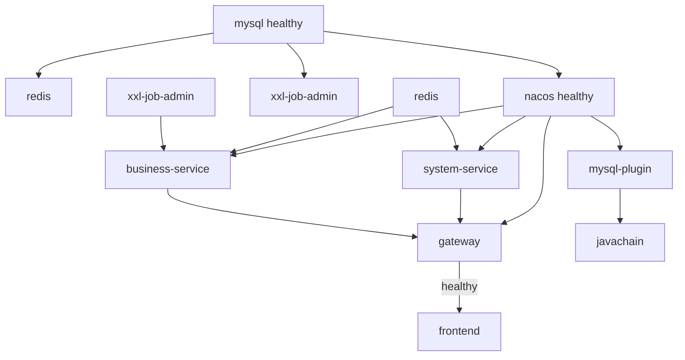
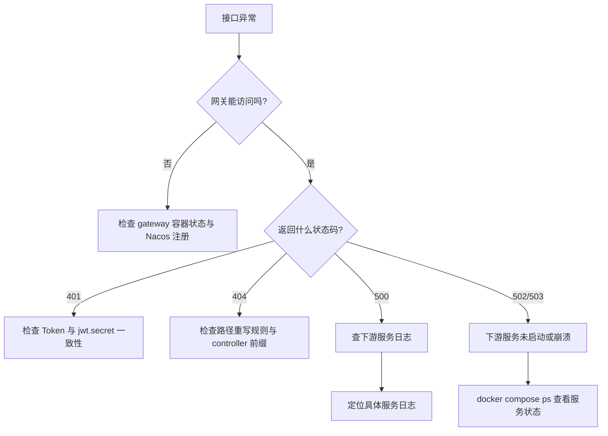

# 部署运维手册

> 项目名称：OA 智能办公管理系统
> 文档版本：v1.0
> 最后更新：2026-10-04
> 适用对象：运维、DevOps、研发自测

---

## 1. 环境要求

### 1.1 本机开发环境

| 组件 | 版本要求 | 说明 |
| --- | --- | --- |
| JDK | **21**（强制） | 所有 Java 服务编译运行均需 JDK 21 |
| Maven | 3.8+ | 无 Maven Wrapper，需系统安装 |
| Node.js | 18+ | 前端构建 |
| MySQL | 8+ | 业务数据库 |
| Redis | 6+ | 缓存 |
| Nacos | 2.x+（推荐 3.x） | 注册中心；MCP 功能需 3.x |
| Docker | 20+ | 如需容器化部署 |
| Docker Compose | v2 | — |

> ⚠️ JDK 版本不匹配是**最常见的构建失败原因**，构建前务必确认 `java -version` 输出为 21。

### 1.2 Docker 化部署环境

只需安装 Docker Desktop（或 Docker Engine + Compose）。

---

## 2. 端口规划

### 2.1 端口分配表

| 服务 | 容器内端口 | 宿主机端口 | 访问地址 |
| --- | --- | --- | --- |
| MySQL | 3306 | **3307** | `localhost:3307` |
| Redis | 6379 | **6380** | `localhost:6380` |
| Nacos 控制台 | 8080 | 8080 | `http://localhost:8080` |
| Nacos 服务端口 | 8848 | 8848 | `localhost:8848` |
| Nacos gRPC | 9848 | 9848 | — |
| XXL-Job Admin | 8080 | **8088** | `http://localhost:8088/xxl-job-admin` |
| XXL-Job 执行器 | 9999 | 9999 | — |
| gateway | 8085 | 8085 | `http://localhost:8085` |
| system-service | 8081 | 8081 | — |
| business-service | 8082 | 8082 | — |
| mysql-plugin | 8083 | 8083 | — |
| javachain | 8087 | 8087 | — |
| frontend | 80 | **5173** | `http://localhost:5173` |

### 2.2 端口偏移设计说明

宿主机做了端口偏移以**避免与本机已安装的 MySQL / Redis 冲突**：

| 服务 | 偏移原因 |
| --- | --- |
| MySQL 3306 → 3307 | 避免与本机 MySQL 冲突 |
| Redis 6379 → 6380 | 避免与本机 Redis 冲突 |
| XXL-Job 8080 → 8088 | 避免与 Nacos 控制台 8080 冲突 |
| 前端 80 → 5173 | 非特权端口，且与开发环境端口一致 |

> ⚠️ **从宿主机连接容器内的 MySQL / Redis 时，必须使用宿主机端口（3307 / 6380）**；容器之间互访使用容器内端口（3306 / 6379）。

---

## 3. 本地开发部署

### 3.1 启动基础设施

先启动 MySQL、Redis、Nacos，并确认连接信息与各服务配置一致。

**数据库初始化**：

```sql
CREATE DATABASE example_db DEFAULT CHARACTER SET utf8mb4 COLLATE utf8mb4_general_ci;
```

```bash
# 执行业务库初始化
mysql -uroot -p example_db < sql/init.sql
# 如需 XXL-Job
mysql -uroot -p < sql/xxl_job.sql
```

### 3.2 构建并启动后端

```bash
# 根工程构建（gateway / system-service / business-service）
mvn clean package

# 分别启动（或使用 IDE 运行启动类）
mvn -pl system-service spring-boot:run
mvn -pl business-service spring-boot:run
mvn -pl gateway spring-boot:run
```

**javachain 是独立工程，必须单独构建**：

```bash
cd javachain
mvn clean package
mvn spring-boot:run
```

### 3.3 启动前端

```bash
cd oa-frontend
npm install
npm run dev
```

访问 `http://localhost:5173`。

### 3.4 环境变量配置

敏感信息建议通过环境变量注入：

```powershell
$env:MYSQL_HOST="localhost"
$env:MYSQL_PORT="3306"
$env:MYSQL_DATABASE="example_db"
$env:MYSQL_USERNAME="root"
$env:MYSQL_PASSWORD="your_password"
$env:REDIS_HOST="localhost"
$env:REDIS_PORT="6379"
$env:NACOS_SERVER_ADDR="127.0.0.1:8848"
$env:DEEPSEEK_API_KEY="your_deepseek_api_key"
$env:DASHSCOPE_API_KEY="your_dashscope_api_key"
```

```bash
# bash 等价写法
export MYSQL_HOST=localhost
export MYSQL_PASSWORD=your_password
export DEEPSEEK_API_KEY=your_deepseek_api_key
```

**javachain 的 LLM 配置**：

```powershell
$env:JAVACHAIN_LLM_PROVIDER="deepseek"     # 或 ollama
$env:DEEPSEEK_API_KEY="sk-xxx"
$env:DEEPSEEK_BASE_URL="https://api.deepseek.com/v1"

# 使用 Ollama 时
$env:JAVACHAIN_LLM_PROVIDER="ollama"
$env:OLLAMA_BASE_URL="http://localhost:11434"
$env:OLLAMA_MODEL="deepseek-r1:7b"
```

### 3.5 关键环境变量清单

| 变量 | 服务 | 默认值 | 说明 |
| --- | --- | --- | --- |
| `NACOS_SERVER_ADDR` | 全部 | `127.0.0.1:8848` | Nacos 地址 |
| `NACOS_NAMESPACE` | 全部 | `public` | 命名空间 |
| `NACOS_USERNAME` | 全部 | `nacos` | Nacos 账号 |
| `NACOS_PASSWORD` | 全部 | `nOn2h1l8cHSG` | Nacos 密码 |
| `MYSQL_URL` | system/business | — | 完整 JDBC URL |
| `MYSQL_HOST` / `MYSQL_PORT` | javachain | `localhost` / `3306` | MySQL 地址 |
| `MYSQL_USERNAME` / `MYSQL_PASSWORD` | 全部 | `root` / — | MySQL 账号 |
| `REDIS_HOST` / `REDIS_PORT` | 全部 | `localhost` / `6379` | Redis 地址 |
| `JAVACHAIN_LLM_PROVIDER` | javachain | `deepseek` | LLM 提供方 |
| `DEEPSEEK_API_KEY` | javachain | 空 | DeepSeek 密钥 |
| `DASHSCOPE_API_KEY` | javachain | 空 | 向量化密钥 |
| `MCP_TARGET_SERVICE` | javachain | `mysql-mcp-server` | MCP 目标服务名 |
| `MCP_FALLBACK_BASE_URL` | javachain | `http://127.0.0.1:8083` | MCP 回退地址 |
| `XXL_JOB_ADMIN_ADDRESSES` | business | `http://127.0.0.1:8088/xxl-job-admin` | 调度中心地址 |

---

## 4. Docker Compose 部署

### 4.1 构建前置条件

Docker 构建依赖本机已打好的 jar 包，**必须先完成三步构建**：

```bash
# 1. 构建根工程
mvn -DskipTests package

# 2. 构建 javachain（独立工程）
cd javachain && mvn -DskipTests package && cd ..

# 3. 构建 MCP 插件（位于独立仓库）
cd D:\my_mcp\mysql-plugin && mvn -DskipTests package && cd D:\vue\java-backend
```

> ⚠️ `mysql-plugin` 位于项目外部目录 `D:\my_mcp\mysql-plugin`，由 `docker-compose.yml` 的 `build.context` 引用。该目录不存在时 Compose 构建会失败——如需绕过，可注释掉 `mysql-plugin` 与 `javachain` 服务。

### 4.2 配置 .env

```bash
# 国内网络推荐使用镜像加速模板
cp .env.docker.example .env
```

编辑 `.env`：

| 变量 | 说明 |
| --- | --- |
| `*_IMAGE` | 各基础镜像地址，可切换国内加速源 |
| `TCR_PREFIX` | 自定义服务镜像仓库前缀 |
| `IMAGE_TAG` | 镜像标签 |
| `DEEPSEEK_API_KEY` | DeepSeek 密钥 |
| `DASHSCOPE_API_KEY` | DashScope 密钥 |

**国内镜像加速**（Docker Hub 拉取超时时）：

```properties
MYSQL_IMAGE=docker.m.daocloud.io/library/mysql:8.0
REDIS_IMAGE=docker.m.daocloud.io/library/redis:7-alpine
NACOS_IMAGE=docker.m.daocloud.io/nacos/nacos-server:v3.2.2
XXL_JOB_ADMIN_IMAGE=docker.m.daocloud.io/xuxueli/xxl-job-admin:2.4.1
JAVA21_IMAGE=docker.m.daocloud.io/library/eclipse-temurin:21-jre
NODE_IMAGE=docker.m.daocloud.io/library/node:20-alpine
NGINX_IMAGE=docker.m.daocloud.io/library/nginx:1.27-alpine
```

### 4.3 启动与访问

```bash
docker compose up -d --build
```

**访问地址**：

| 服务 | 地址 | 账号 |
| --- | --- | --- |
| 前端 | http://localhost:5173 | admin / 见数据库文档 |
| 网关 | http://localhost:8085 | — |
| Nacos 控制台 | http://localhost:8080 | nacos / nOn2h1l8cHSG |
| XXL-Job 控制台 | http://localhost:8088/xxl-job-admin | admin / 123456 |
| MySQL | localhost:3307 | root / your_actual_password |
| Redis | localhost:6380 | 无密码 |
| mysql-plugin | http://localhost:8083 | — |
| javachain | http://localhost:8087 | — |

### 4.4 启动顺序与依赖

服务依赖由 `depends_on` + `healthcheck` 保证：



| 服务 | 依赖条件 |
| --- | --- |
| `system-service` | mysql(healthy)、redis(started)、nacos(healthy) |
| `business-service` | mysql(healthy)、redis(started)、nacos(healthy)、xxl-job-admin(started) |
| `gateway` | nacos(healthy)、system-service(started)、business-service(started) |
| `frontend` | gateway(**healthy**) |
| `mysql-plugin` | mysql(healthy)、nacos(healthy) |
| `javachain` | mysql(healthy)、redis(started)、nacos(healthy)、mysql-plugin(started) |

**健康检查**：

| 服务 | 检查方式 | 通过条件 |
| --- | --- | --- |
| mysql | `mysqladmin ping` | 能 ping 通 |
| nacos | 登录接口返回 accessToken | 含 `accessToken` 字段 |
| gateway | 请求 `/api/system/users` | 返回 **401**（说明鉴权生效且服务存活） |

> 网关健康检查期望返回 401 而非 200，这是一个巧妙的设计——既验证了网关存活，又验证了鉴权链路工作正常。

### 4.5 常用运维命令

```bash
# 查看服务状态
docker compose ps

# 查看日志
docker compose logs -f                    # 全部
docker compose logs -f gateway            # 指定服务
docker compose logs --tail=100 javachain  # 最近 100 行

# 重启单个服务
docker compose restart gateway

# 重新构建并启动单个服务
docker compose up -d --build system-service

# 停止（保留数据）
docker compose down

# 停止并删除数据卷（⚠️ 数据丢失）
docker compose down -v
```

---

## 5. 打包与发布

### 5.1 后端打包

```bash
# 根工程
mvn -DskipTests package

# javachain
cd javachain && mvn -DskipTests package && cd ..
```

**产物路径**：

| 模块 | jar 路径 |
| --- | --- |
| gateway | `gateway/target/gateway-1.0.0.jar` |
| system-service | `system-service/target/system-service-1.0.0.jar` |
| business-service | `business-service/target/business-service-1.0.0.jar` |
| javachain | `javachain/target/javachain-1.0.0.jar` |

### 5.2 前端打包

```bash
cd oa-frontend
npm ci          # 或 npm install
npm run build   # 产物输出到 dist/
```

### 5.3 Docker 镜像构建

所有 Java 服务共用同一个 Dockerfile：`docker/java21-runtime/Dockerfile`

```dockerfile
ARG BASE_IMAGE=eclipse-temurin:21-jre
FROM ${BASE_IMAGE}
WORKDIR /app
ARG JAR_FILE
COPY ${JAR_FILE} app.jar
EXPOSE 8080
ENTRYPOINT ["java", "-jar", "/app/app.jar"]
```

**特点**：构建参数传入 jar 路径，镜像内统一命名为 `app.jar`。

前端使用多阶段构建（`oa-frontend/Dockerfile`）：

```text
阶段一（node:20-alpine）：npm ci → npm run build → 产出 dist/
阶段二（nginx:1.27-alpine）：拷贝 dist 到 /usr/share/nginx/html，应用 nginx.conf
```

### 5.4 推送镜像到 TCR

```bash
# 登录（示例：腾讯云容器镜像服务）
docker login ccr.ccs.tencentyun.com

# 构建并推送
docker compose build
docker compose push
```

`TCR_PREFIX` 与 `IMAGE_TAG` 在 `.env` 中配置。

---

## 6. 生产环境部署建议

### 6.1 云服务器部署

腾讯云部署模板见 `.env.cloud`：

```bash
cp .env.cloud .env
# 编辑 .env，修改所有密码与密钥
```

**部署前必须修改的项**：

| 项 | 默认值 | 风险 |
| --- | --- | --- |
| `MYSQL_ROOT_PASSWORD` | `your_actual_password` | 弱密码，必须修改 |
| `NACOS_PASSWORD` | `nOn2h1l8cHSG` | 已泄露在仓库中，必须修改 |
| `DEEPSEEK_API_KEY` | 真实密钥 | **已泄露在仓库中，必须轮换** |
| `DASHSCOPE_API_KEY` | 真实密钥 | **已泄露在仓库中，必须轮换** |
| `jwt.secret` | 固定字符串 | 建议改为随机值（四服务同步） |
| `NACOS_AUTH_TOKEN` | 固定 Base64 | 建议重新生成 |

### 6.2 安全加固清单

- [ ] **轮换所有已提交到仓库的密钥**（DeepSeek、DashScope）
- [ ] 修改 MySQL / Nacos 默认密码
- [ ] 更换 `jwt.secret`（**gateway、system-service、business-service、javachain 四处必须一致**）
- [ ] 清理 Git 历史中的密钥（`git filter-repo` 或 BFG）
- [ ] 确认 `.env` 不再被提交（当前 `.gitignore` 已包含，但历史中可能仍有）
- [ ] Nacos 开启鉴权并限制外网访问
- [ ] 生产环境关闭不需要的端口暴露（如 MySQL 不应暴露公网）
- [ ] 前端启用 HTTPS，网关配置 CORS 白名单（当前为 `*`）
- [ ] 补充接口级权限校验（当前 system-service 为 `permitAll`）

### 6.3 资源配置建议

| 服务 | JVM 堆配置 | 说明 |
| --- | --- | --- |
| mysql | — | 建议 ≥ 2G 内存 |
| nacos | `-Xms256m -Xmx512m` | 已在 compose 中配置 |
| system-service | `-Xms128m -Xmx512m` | — |
| business-service | `-Xms128m -Xmx512m` | — |
| gateway | `-Xms128m -Xmx384m` | — |
| mysql-plugin | `-Xms128m -Xmx384m` | — |
| javachain | `-Xms256m -Xmx768m` | AI 服务，内存需求较高 |

---

## 7. 监控与日志

### 7.1 日志位置

| 服务 | 日志位置 |
| --- | --- |
| 容器内应用日志 | `docker compose logs` |
| business-service 本地日志 | `logs/` 目录 |
| XXL-Job 执行器日志 | 容器内 `/app/logs/xxl-job/jobhandler` |
| javachain 临时文件 | `javachain/temp/`、`javachain/tempFile/`（gitignore） |

### 7.2 日志级别

| 服务 | 模块 | 级别 |
| --- | --- | --- |
| gateway | `com.oa.gateway` | info |
| javachain | `com.example.javachain` | **DEBUG**（生产建议调为 INFO） |
| javachain | `dev.langchain4j` | info |
| javachain | `com.alibaba.nacos` | DEBUG |
| business-service | MyBatis SQL | `StdOutImpl`（生产建议关闭或改为 Slf4j） |

> ⚠️ **生产优化建议**：javachain 的 DEBUG 级别与 business-service 的 MyBatis 标准输出日志在生成环境会产生大量日志，建议调整。

### 7.3 健康检查端点

| 服务 | 检查方式 |
| --- | --- |
| gateway | `curl http://localhost:8085/api/system/users` → 期望 401 |
| nacos | `curl -X POST http://localhost:8848/nacos/v1/auth/users/login -d 'username=nacos&password=...'` |
| mysql | `mysqladmin ping` |

### 7.4 Agent 性能指标

javachain 的 `ReActAgent` 内置指标可通过日志观察：总请求数、工具调用数、成功数、失败数、平均耗时。

---

## 8. 故障排查

### 8.1 常见问题速查

| 现象 | 可能原因 | 排查与解决 |
| --- | --- | --- |
| 构建失败，提示 class 版本错误 | 本地 JDK 非 21 | `java -version` 确认，切换 JDK 21 |
| javachain 编译失败，依赖找不到 | 未进入 javachain 目录（独立工程） | `cd javachain` 后单独构建 |
| 所有接口返回 401 | JWT 密钥不一致 | 检查四个服务的 `jwt.secret` 是否相同 |
| 接口 404 | 路径重写规则不匹配 | 确认 controller 前缀：system→`/system`、business→`/business`、javachain→`/api` |
| 网关启动失败 | 下游服务未注册 | 检查 Nacos 控制台服务列表 |
| 前端请求失败 | 网关未启动 | 先启动网关；Vite 代理指向 8085 |
| 前端跳转维护页 | 后端 502/503 或超时 | 检查后端服务与网关日志 |
| 连不上数据库 | 用了容器内端口 | 宿主机连 MySQL 用 **3307**，Redis 用 **6380** |
| AI 问答无响应 | 未配置 API Key | 检查 `DEEPSEEK_API_KEY` / `DASHSCOPE_API_KEY` |
| 知识库问答答不上来 | 数据在内存，重启后丢失 | 重新执行向量化 |
| MCP 工具调用失败 | mysql-plugin 未注册或未启动 | 检查 `docker compose logs mysql-plugin`，确认 Nacos 中有 `mysql-mcp-server` |
| `docker compose build` 失败 | `D:\my_mcp\mysql-plugin` 不存在 | 构建该外部项目，或注释对应服务 |
| Nacos 健康检查不通过 | 密码配置不一致 | 检查 compose 中 `NACOS_PASSWORD` 与健康检查命令是否一致 |
| 前端 Docker 构建失败 | `npm ci` 缺 package-lock | 确认 `oa-frontend/package-lock.json` 存在 |

### 8.2 排查流程



### 8.3 实用排查命令

```bash
# 检查容器状态
docker compose ps

# 检查服务是否注册到 Nacos
# 访问 http://localhost:8080 → 服务管理 → 服务列表

# 检查网关到下游的连通性
docker compose exec gateway curl -s http://system-service:8081/system/dashboard/stats

# 检查 MySQL 初始化是否成功
docker compose exec mysql mysql -uroot -p'your_actual_password' -e "USE example_db; SHOW TABLES;"

# 检查 Redis
docker compose exec redis redis-cli ping

# 查看某服务最近错误
docker compose logs --tail=200 gateway | grep -i error
```

### 8.4 数据重置

```bash
# ⚠️ 完全重置（删除所有数据）
docker compose down -v
docker compose up -d --build

# 仅重启数据库容器（数据卷保留）
docker compose restart mysql
```

---

## 9. 备份与恢复

### 9.1 数据库备份

```bash
# 备份
docker exec oa-mysql mysqldump -uroot -p'your_actual_password' \
  --single-transaction --routines --triggers \
  example_db > backup_example_db_$(date +%Y%m%d_%H%M%S).sql

# 备份 XXL-Job 库
docker exec oa-mysql mysqldump -uroot -p'your_actual_password' \
  xxl_job > backup_xxl_job_$(date +%Y%m%d_%H%M%S).sql
```

### 9.2 数据库恢复

```bash
docker exec -i oa-mysql mysql -uroot -p'your_actual_password' example_db < backup_example_db_20261004.sql
```

### 9.3 数据卷备份

```bash
# 查看数据卷
docker volume ls | grep oa

# 备份数据卷（示例）
docker run --rm -v java-backend_mysql-data:/data -v $(pwd):/backup \
  alpine tar czf /backup/mysql-data-backup.tar.gz -C /data .
```

### 9.4 建议备份策略

| 对象 | 频率 | 保留 |
| --- | --- | --- |
| MySQL 业务库 | 每日 | 30 天 |
| XXL-Job 库 | 每周 | 8 周 |
| 关键配置（.env） | 变更时 | 永久 |
| 镜像版本 | 每次发布 | 保留最近 5 个 tag |

---

## 10. 附录

### 10.1 相关文件索引

| 文件 | 说明 |
| --- | --- |
| `docker-compose.yml` | 编排定义 |
| `docker/java21-runtime/Dockerfile` | Java 服务通用 Dockerfile |
| `oa-frontend/Dockerfile` | 前端多阶段构建 |
| `oa-frontend/nginx.conf` | 生产 Nginx 配置 |
| `.env` | 当前环境变量（**已提交，含密钥**） |
| `.env.docker.example` | Docker 环境变量模板 |
| `.env.cloud` | 腾讯云部署模板 |
| `.dockerignore` | Docker 构建忽略规则 |
| `README-docker.md` | Docker 快速开始 |

### 10.2 相关文档

- [产品需求文档](../01-产品/PRD-产品需求文档.md)
- [技术设计文档](../02-技术/TRD-技术设计文档.md)
- [API 接口文档](../03-接口/API-接口文档.md)
- [数据库设计文档](../04-数据库/数据库设计文档.md)
- [开发规范与贡献指南](../06-规范/开发规范与贡献指南.md)
- [需求开发流程](../06-规范/需求开发流程.md)

---

## 变更记录

| 版本 | 日期 | 变更内容 | 关联 Issue | 修改人 |
| --- | --- | --- | --- | --- |
| v1.0 | 2026-10-04 | 初版，覆盖本地/Docker 部署、端口规划与故障排查 | — | — |
