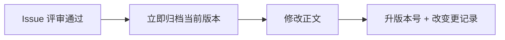

# 变更管理规范

> 项目名称：OA 智能办公管理系统
> 文档版本：v1.0
> 最后更新：2026-10-04
> 适用对象：全体研发、产品、测试

---

## 1. 目的

规范**文档版本管理、变更记录与归档**规则，确保：

1. 任意时刻都能回答"**系统现在应该是什么样**"
2. 任意时刻都能追溯"**某功能是什么时候、为什么变成现在这样**"
3. 文档与代码始终一致

流程层面的描述见 [需求开发流程](需求开发流程.md)，本规范聚焦**文档自身的版本与归档规则**。

---

## 2. 版本号规则

### 2.1 文档版本号

采用 `v<主版本>.<次版本>` 两段式：

| 段位 | 递增条件 | 示例 |
| --- | --- | --- |
| **主版本** | 结构性变更：功能模块增删、架构调整、数据模型重构 | v1.0 → v2.0 |
| **次版本** | 局部变更：字段增减、接口调整、规则微调、文字修订 | v1.0 → v1.1 |

**判定依据**：

| 变更类型 | 版本位 |
| --- | --- |
| 新增/删除整个功能模块 | 主版本 |
| 新增/删除一张表 | 主版本 |
| 认证/权限模型变化 | 主版本 |
| 新增/修改一个接口 | 次版本 |
| 表增删字段 | 次版本 |
| 修改业务规则阈值 | 次版本 |
| 文字、排版、错别字 | 次版本 |

> 💡 **原则**：拿不准时，**降级处理**（用次版本）。版本号升太快会让文档显得不稳定。

### 2.2 各文档版本独立

**各文档版本号独立演进**，不强求一致：

| 文档 | 当前版本 | 说明 |
| --- | --- | --- |
| PRD | v1.0 | 产品视角 |
| TRD | v1.0 | 技术视角 |
| API 文档 | v1.0 | 接口视角 |
| 数据库设计文档 | v1.0 | 数据视角 |
| 部署运维手册 | v1.0 | 运维视角 |
| 开发规范与贡献指南 | v1.0 | 规范视角 |
| 需求开发流程 | v1.0 | 流程视角 |
| 变更管理规范 | v1.0 | 规范视角 |

> 例：一次"商品加字段"的变更，可能使 API 文档升到 v1.5，而 PRD 只有 v1.2——这是正常的，因为各文档被改动的频率不同。

### 2.3 项目版本号

项目整体版本（Release）用 `v<主>.<次>.<修订>` 三段式：

```text
v1.0.0    首个可交付版本
v1.1.0    新增供应商字段（次版本：新增能力）
v1.1.1    修复供应商字段校验缺陷（修订：仅修复）
v2.0.0    权限模型重构（主版本：不兼容变更）
```

---

## 3. 文档头部与尾部规范

### 3.1 头部元信息（每份文档必需）

```markdown
> 项目名称：OA 智能办公管理系统
> 文档版本：v1.0
> 最后更新：2026-10-04
> 适用对象：产品、研发、测试、运营
```

| 字段 | 要求 |
| --- | --- |
| 项目名称 | 固定 |
| 文档版本 | 每次修改递增 |
| 最后更新 | 每次修改更新为当天日期 |
| 适用对象 | 说明谁会读这份文档 |

### 3.2 尾部变更记录（每份文档必需）

文档末尾必须包含**变更记录**表：

```markdown
## 变更记录

| 版本 | 日期 | 变更内容 | 关联 Issue | 修改人 |
| --- | --- | --- | --- | --- |
| v1.1 | 2026-10-10 | 商品管理新增供应商字段 | #12 | 张三 |
| v1.0 | 2026-10-04 | 初版 | — | — |
```

**填写要求**：

| 列 | 要求 |
| --- | --- |
| 版本 | 递增后的版本号 |
| 日期 | 变更当天日期（YYYY-MM-DD） |
| 变更内容 | **一句话说清改了什么**，避免"优化""调整" |
| 关联 Issue | `#编号`，无 Issue 填 `—` |
| 修改人 | 实际修改者 |

**顺序**：最新版本在最上（倒序），便于阅读。

---

## 4. 归档规范

### 4.1 归档目录结构

```text
docs/
├── archive/                          # 历史版本归档
│   ├── README.md                     # 归档索引与说明
│   ├── PRD-v1.0.md
│   ├── TRD-v1.0.md
│   ├── API-v1.0.md
│   └── 数据库设计-v1.0.md
├── 01-产品/
│   └── PRD-产品需求文档.md            # ← 永远是当前版
├── 02-技术/
│   └── TRD-技术设计文档.md
└── ...
```

**关键约定**：

| 约定 | 说明 |
| --- | --- |
| 正文目录只放当前版 | 文件名**不带版本号** |
| 归档目录放历史版 | 文件名**必须带版本号** |
| 只归档被改的文档 | 不要每次全量复制 |

### 4.2 归档时机



> ⚠️ **顺序不能反**：必须先归档再改正文。改完再归档，存的就是新版了，历史基线丢失。

### 4.3 归档命名规范

```text
<文档简称>-v<版本>.md
```

| 文档 | 归档文件名示例 |
| --- | --- |
| PRD | `PRD-v1.0.md`、`PRD-v1.1.md` |
| TRD | `TRD-v1.0.md` |
| API | `API-v1.0.md` |
| 数据库设计 | `数据库设计-v1.0.md` |
| 部署运维 | `部署运维-v1.0.md` |

### 4.4 归档操作

```bash
# 归档当前版本（以 PRD 为例，当前 v1.0，即将升为 v1.1）
cp docs/01-产品/PRD-产品需求文档.md docs/archive/PRD-v1.0.md

# 然后在正文中升版本号为 v1.1 并修改内容
```

**归档时要做的事**：

- [ ] 复制当前正文到 `docs/archive/<名称>-v<旧版本>.md`
- [ ] 在归档文件头部标注"**本文档为历史版本，最新版见 …**"
- [ ] 在 `docs/archive/README.md` 索引表中登记

### 4.5 归档文件头部标注

归档文件顶部必须加醒目标识：

```markdown
> ⚠️ **历史版本归档**
> 本文件为 PRD 的 v1.0 版本，已归档，**不再维护**。
> 最新版本见 [docs/01-产品/PRD-产品需求文档.md](../01-产品/PRD-产品需求文档.md)
>
> 归档日期：2026-10-10
> 归档原因：商品管理新增供应商字段（#12）
```

---

## 5. 项目级 CHANGELOG

除各文档自己的变更记录外，仓库根 `docs/CHANGELOG.md` 记录**项目级**变更。

### 5.1 定位区别

| 载体 | 粒度 | 内容 |
| --- | --- | --- |
| 各文档的变更记录 | 细 | "这份文档改了什么" |
| `docs/CHANGELOG.md` | 粗 | "这个版本发布了什么" |

### 5.2 CHANGELOG 格式

遵循 [Keep a Changelog](https://keepachangelog.com/zh-CN/1.1.0/) 风格：

```markdown
## [v1.1.0] - 2026-10-10

### 新增
- 商品管理支持供应商字段 (#12)

### 变更
- 订单超时时间由 30 分钟调整为 60 分钟 (#14)

### 修复
- 修复 Token 过期后未跳转登录页的问题 (#15)

### 文档
- 同步更新 PRD、API、数据库文档
```

**分类标签**：

| 标签 | 含义 |
| --- | --- |
| 新增 | 新功能 |
| 变更 | 已有功能的调整 |
| 弃用 | 即将移除的功能 |
| 移除 | 已移除的功能 |
| 修复 | 缺陷修复 |
| 安全 | 安全相关修复 |
| 文档 | 仅文档变更 |

### 5.3 何时更新 CHANGELOG

| 时机 | 是否更新 |
| --- | --- |
| 每次合并到 `master` | ✅ |
| 打 Release 标签 | ✅ |
| 日常 `dev` 分支开发 | ❌（合并时统一整理） |
| 纯文档修订 | ⚠️ 视情况，一般合并进对应版本条目 |

---

## 6. 变更影响评估表

提单时必须填写的影响评估。**这是评审的核心依据**。

| 维度 | 是否影响 | 具体说明 |
| --- | --- | --- |
| PRD（需求/规则） | ☐ | |
| TRD（技术方案） | ☐ | |
| API 文档（接口） | ☐ | |
| 数据库（表/字段/索引） | ☐ | |
| 部署运维手册 | ☐ | |
| 开发规范 | ☐ | |
| **兼容性** | ☐ | 是否影响已有数据/调用方 |
| **数据迁移** | ☐ | 是否需要迁移脚本 |
| **测试用例** | ☐ | 需新增/修改哪些用例 |
| **回滚方案** | ☐ | 出问题怎么退 |

> ⚠️ **兼容性**是评审重点。例如"接口响应新增字段"对调用方通常安全，但"删除字段"或"改字段类型"属于**破坏性变更**，必须评估过渡方案。

---

## 7. 各文档变更责任人与触发条件

| 文档 | 责任人 | 变更触发条件 |
| --- | --- | --- |
| PRD | 产品 | 功能范围、业务规则、用户故事、验收标准变化 |
| TRD | 研发负责人 | 架构、模块划分、技术方案、设计决策变化 |
| API 文档 | 后端研发 | 新增/修改/删除接口，出入参变化 |
| 数据库设计文档 | 后端研发 | 表/字段/索引增删改 |
| 部署运维手册 | 研发 / 运维 | 部署方式、端口、环境变量、依赖变化 |
| 开发规范与贡献指南 | 团队共识 | 新增编码约定、流程调整 |
| 需求开发流程 | 团队共识 | 流程步骤调整 |
| 变更管理规范 | 团队共识 | 版本/归档规则调整 |
| `sql/` 脚本 | 后端研发 | 表结构变化（同步数据库文档） |
| `CODEBUDDY.md` | 研发 | 仓库结构或协作约定变化 |

**同步要求**：`sql/` 脚本与数据库文档**必须同步修改**，且在同一 PR 中。

---

## 8. 反模式（不要这样做）

| 反模式 | 问题 | 正确做法 |
| --- | --- | --- |
| 直接改 PRD 正文不留痕 | 无法追溯 | 归档 + 升版本 + 记变更 |
| 改完正文才归档 | 归档的是新版，历史丢失 | 先归档，再改 |
| 把版本号写进正文文件名 | 文件夹混乱，不知哪份最新 | 正文不带版本号，归档才带 |
| 文档改动与代码改动分开提交 | 极易漏改文档 | 同一个 PR |
| 无差别全量归档 | 目录膨胀 | 只归档被改的文档 |
| 变更记录写"优化""调整" | 信息量为零 | 写清"从什么改成什么" |
| 只在 Issue 里记录，不改文档 | 新人无法从文档了解现状 | Issue 记过程，文档记现状 |
| 需求没变却改 PRD | 污染基线可信度 | 只改受影响的文档 |
| 版本号随意跳跃 | 版本失去意义 | 按规则递增 |

---

## 9. 快速操作指引

### 9.1 我要改一个功能（完整操作）

```bash
# 1. 提 Issue（GitHub 网页操作）

# 2. 评审通过后，归档当前版本
cp docs/01-产品/PRD-产品需求文档.md docs/archive/PRD-v1.0.md
# 在归档文件头部加"历史版本"标注
# 在 docs/archive/README.md 登记

# 3. 拉分支
git checkout dev
git checkout -b feature/12-product-supplier

# 4. 修改文档（正文 + 头部版本号 + 尾部变更记录）

# 5. 实现代码

# 6. 提交（文档与代码一起）
git add docs/ src/
git commit -m "feat(business): 商品新增供应商字段 (#12)"

# 7. 提 PR，关联 Issue
```

### 9.2 判断清单

改之前问自己：

- [ ] 有 Issue 吗？没有 → 先提
- [ ] 影响哪几份文档？列出来
- [ ] 归档了吗？没有 → 先归档
- [ ] 改完升版本号了吗？
- [ ] 变更记录表加行了吗？
- [ ] `sql/` 脚本和数据库文档同步了吗？
- [ ] 文档和代码在同一个 PR 吗？

---

## 10. 相关文档

- [需求开发流程](需求开发流程.md) — 端到端九步法
- [开发规范与贡献指南](开发规范与贡献指南.md) — 编码与 Git 规范
- [归档目录说明](../archive/README.md)
- [CHANGELOG](../CHANGELOG.md)
- [文档导航](../README.md)

---

## 变更记录

| 版本 | 日期 | 变更内容 | 关联 Issue | 修改人 |
| --- | --- | --- | --- | --- |
| v1.0 | 2026-10-04 | 初版，定义文档版本、变更记录与归档规则 | — | — |
