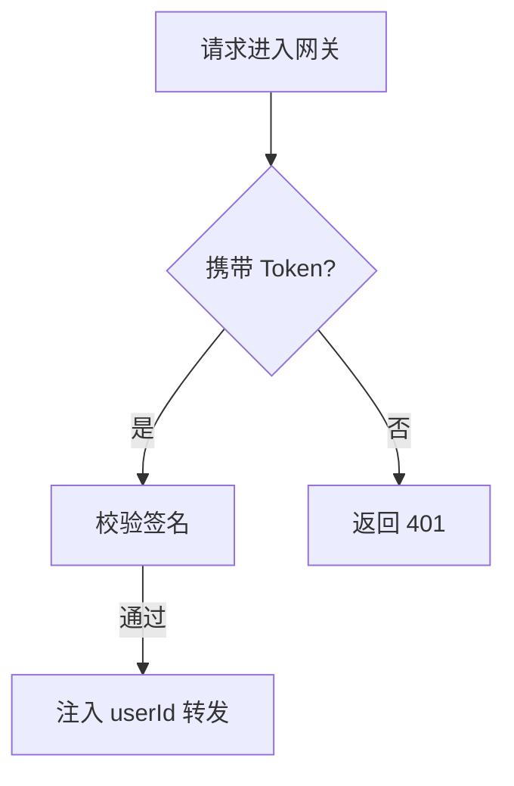

# 文档编写规范

> 项目名称：OA 智能办公管理系统
> 文档版本：v1.1
> 最后更新：2026-10-06
> 适用对象：全体文档编写者（产品、研发、测试、运维）

---

## 1. 目的与范围

### 1.1 编写目的

统一文档的**结构与表达方式**，让所有文档读起来像同一个人写的：

- 结构一致 → 读者能凭直觉定位信息，不必每份文档重新"找路"
- 表达一致 → 同一概念用同一个词，减少歧义
- 格式一致 → 差异只出现在内容上，方便 review 与 diff

### 1.2 与其他规范的分工

三份规范各管一段，**不要混淆**：

| 规范 | 管什么 | 核心问题 |
| --- | --- | --- |
| [需求开发流程](需求开发流程.md) | **什么时候改** | 什么条件下才能动文档 |
| [变更管理规范](变更管理规范.md) | **版本与归档** | 改完怎么标版本、怎么留旧版 |
| **本文（文档编写规范）** | **怎么写** | 文档的结构、格式、用词 |

> 简单记：流程管"能不能写"，变更管理管"写完怎么记"，本文管"具体怎么写"。

### 1.3 适用范围

适用于 `docs/` 下所有文档，以及仓库根 `README.md`、`CODEBUDDY.md`。

**例外**：`docs/archive/` 下的历史归档文件**冻结不动**，不受本规范约束（它们应当保持归档时的原貌）。

---

## 2. 文档体系与内容归属

### 2.1 文档分类与职责

每份文档**只回答一类问题**，避免内容互相渗透：

| 文档 | 回答的问题 | 不该写什么 |
| --- | --- | --- |
| PRD | 要做什么、给谁用、验收标准是什么 | 不该写实现方案、表结构 |
| TRD | 怎么做、为什么这么设计 | 不该写接口逐个字段、完整表结构 |
| API 文档 | 接口怎么调、参数是什么 | 不该写业务背景、为什么这么设计 |
| 数据库设计文档 | 数据存哪、字段什么含义 | 不该写接口出入参 |
| 部署运维手册 | 怎么部署、出问题怎么查 | 不该写业务规则 |
| 开发规范与贡献指南 | 代码怎么写、怎么提交 | 不该写需求细节 |

### 2.2 内容归属判定

写之前先问一句：**"这段内容属于哪份文档？"**

| 你正在写的内容 | 应放位置 |
| --- | --- |
| 某功能对用户的价值 | PRD |
| 某功能的技术选型理由 | TRD |
| 某接口的请求/响应示例 | API 文档 |
| 某张表的字段类型与约束 | 数据库设计文档 |
| 某服务启动失败怎么排查 | 部署运维手册 |
| 某段代码应遵循的命名规则 | 开发规范与贡献指南 |

> ⚠️ **发现内容放错位置时**：不要原地复制一份，而是**移动**到正确文档，在原处留一句指向链接。

---

## 3. 文件与目录规范

### 3.1 目录结构

```text
docs/
├── README.md                    # 文档导航（总入口）
├── CHANGELOG.md                 # 项目级更新日志
├── 01-产品/                      # 产品视角
├── 02-技术/                      # 技术视角
├── 03-接口/                      # 接口视角
├── 04-数据库/                    # 数据视角
├── 05-运维/                      # 运维视角
├── 06-规范/                      # 规范与流程
├── _templates/                  # 可复用模板（工具目录，不参与版本管理）
└── archive/                     # 历史版本归档（只读）
```

**规则**：

| 规则 | 说明 |
| --- | --- |
| 目录编号两位 | `01-` ~ `99-`，决定在导航中的排序 |
| 工具目录前缀 `_` | 如 `_templates/`，表示"不是正文文档"，不参与版本管理 |
| `archive/` 只读 | 只往里放，不修改 |

### 3.2 文件命名

| 规则 | 示例 |
| --- | --- |
| 正文文件名**不带版本号** | `PRD-产品需求文档.md` ✅ / `PRD-v1.0.md` ❌ |
| 归档文件名**必须带版本号** | `archive/PRD-v1.0.md` |
| 用中文名，业务方也能看懂 | `部署运维手册.md` |
| 同类文档用「简称-全称」 | `TRD-技术设计文档.md` |
| 不使用空格 | `API-接口文档.md` ✅ / `API 接口文档.md` ❌ |

> 💡 正文不带版本号、归档带版本号 —— 这样"哪个是最新版"永远没有歧义。完整规则见[变更管理规范 · 归档规范](变更管理规范.md#4-归档规范)。

### 3.3 新增文档流程

1. 判断归类 → 放进对应 `docs/<NN-分类>/`
2. 复制骨架（见第 4 节）→ 填头部元信息
3. 在 `docs/README.md` 的索引表中**登记一行**
4. 若涉及代码约定变化，同步更新 `CODEBUDDY.md`

> ⚠️ **新增文档也必须登记**。没有登记的文档等于不存在 —— 没人找得到。

---

## 4. 文档骨架

### 4.1 必备结构

每份正文文档由四部分构成，**顺序固定**：

```markdown
# 文档标题（H1，全文唯一）

> 项目名称：OA 智能办公管理系统      ← 头部元信息
> 文档版本：v1.0
> 最后更新：YYYY-MM-DD
> 适用对象：…

---

## 1. 文档说明                        ← 第一节固定讲清本文定位

## 2. …
...

## 变更记录                            ← 文末固定，且不编号
```

### 4.2 头部元信息

紧跟 H1、用引用块书写，**字段顺序与名称不得改动**：

```markdown
> 项目名称：OA 智能办公管理系统
> 文档版本：v1.0
> 最后更新：2026-10-06
> 适用对象：研发、运维
```

| 字段 | 写法要求 |
| --- | --- |
| 项目名称 | 固定写法，全项目统一 |
| 文档版本 | `v<主>.<次>`，每次修改递增 |
| 最后更新 | `YYYY-MM-DD`，每次修改更新为当天 |
| 适用对象 | 顿号分隔，写"谁会读" |

> ❌ 不要自创字段（如 `作者：`、`状态：`）。需要新增字段时，先在本规范中登记。

### 4.3 变更记录

文末固定一节，**最新版本在最上（倒序）**：

```markdown
## 变更记录

| 版本 | 日期 | 变更内容 | 关联 Issue | 修改人 |
| --- | --- | --- | --- | --- |
| v1.1 | 2026-10-10 | 新增供应商字段说明 | #12 | 张三 |
| v1.0 | 2026-10-04 | 初版 | — | — |
```

> ⚠️ `## 变更记录` **不加编号**，且永远是最后一节。完整填写要求见[变更管理规范](变更管理规范.md#3-文档头部与尾部规范)。

### 4.4 第一节「文档说明」

每份正文文档的第 1 节都叫「文档说明」，讲清三件事：

| 要素 | 说明 |
| --- | --- |
| **本文做什么** | 一两句话说明文档定位与用途 |
| **配套文档** | 列出强相关的其它文档链接 |
| **术语表**（可选） | 文档内使用的专有名词、缩写 |

**示例**：

```markdown
## 1. 文档说明

本文档描述 OA 智能办公管理系统的技术架构、模块划分与关键设计决策，
作为研发实现与后续演进的依据。

配套文档：

- 产品需求：[PRD](../01-产品/PRD-产品需求文档.md)
- 接口定义：[API 接口文档](../03-接口/API-接口文档.md)
```

> 📌 术语表只在**本文首次引入新术语时**才需要。全项目通用术语统一维护在 [PRD 术语表](../01-产品/PRD-产品需求文档.md#12-术语表) 中。

---

## 5. 标题层级规范

### 5.1 层级规则

| 层级 | 用途 | 规则 |
| --- | --- | --- |
| H1 (`#`) | 文档标题 | **全文有且仅有一个** |
| H2 (`##`) | 主章节 | 用于一级主题 |
| H3 (`###`) | 子章节 | 挂在某个 H2 下 |
| H4 (`####`) | 细分点 | **谨慎使用**，超过 H4 说明该拆文档了 |

**硬性规则**：

- ❌ 不得跳级（H2 下不能直接出现 H4）
- ❌ 不得用加粗文字代替标题（`**注意**` 不是标题）
- ❌ 标题里不写句号（`## 1. 文档说明` ✅ / `## 1. 文档说明。` ❌）

### 5.2 编号规则

正文标题**一律编号**，便于交叉引用与口头沟通：

| 层级 | 写法 | 示例 |
| --- | --- | --- |
| H2 | `## <N>. <标题>` | `## 3. 系统架构` |
| H3 | `### <N>.<M> <标题>` | `### 3.1 整体架构` |
| H4 | `#### <N>.<M>.<K> <标题>` | `#### 3.1.1 组件职责` |

**规则**：

- 编号从 **1** 开始，**连续不跳号**
- 编号与标题之间：H2 用**点号 + 空格**（`3. 系统架构`），H3/H4 用**空格**（`3.1 整体架构`）
- `## 变更记录` **不编号**（它是元信息，不是正文）

> 💡 编号带来一个隐性好处：可以写"见 3.2 节"而不用重复标题，跨文档引用时定位更快。

**不编号的文档**：下列文档结构上不属于"章节递进"，**豁免 H2 编号**：

| 文档 | 原因 |
| --- | --- |
| `docs/README.md` | 导航索引，各节并列 |
| `docs/CHANGELOG.md` | 按版本倒序组织 |
| `docs/_templates/*` | 表单模板，用「一、二、三」等中文序号更贴合填写场景 |
| `CODEBUDDY.md` | AI 协作说明，非面向人的正文文档 |

**示例（导航类文档）**：

```markdown
## 文档索引
## 按角色查阅
## 按任务查阅
```

---

## 6. 内容表达规范

### 6.1 写作风格

| 要求 | ✅ 推荐 | ❌ 避免 |
| --- | --- | --- |
| 客观陈述 | 网关校验 JWT 后注入 `userId` | 我觉得网关应该校验一下 |
| 直给结论 | 该接口不支持批量查询 | 关于是否支持批量，需要进一步讨论 |
| 具体可验 | 超时时间 30 秒 | 超时时间较短 |
| 简洁 | 服务启动失败时检查端口占用 | 当服务启动失败的时候，我们应当检查一下端口是否被占用 |

### 6.2 术语统一

**同一概念全文用同一个词**，不要同义混用：

| 统一用 | 不要写 |
| --- | --- |
| 网关 | 网关 / Gateway / 网关服务（混用） |
| 用户 ID | 用户ID / userId / 用户主键（指同一字段时） |
| 知识库 | 知识库 / 资料库 / 文档库 |
| 接口 | 接口 / API / 端点（混用） |

**规则**：

- 全项目通用术语以 [PRD 术语表](../01-产品/PRD-产品需求文档.md#12-术语表) 为准
- 首次出现的缩写，写全称 + 缩写：`基于角色的访问控制（RBAC）`
- 服务名、模块名、字段名、类名、路径 —— **一律用反引号**

```markdown
✅ 调用 `system-service` 的 `/system/user/list` 接口
❌ 调用 system-service 的 /system/user/list 接口
```

### 6.3 中英混排与标点

| 场景 | 规则 | 示例 |
| --- | --- | --- |
| 中英文之间 | **加半角空格** | `使用 Vue 3 开发` |
| 中文与数字之间 | 加半角空格 | `共 11 张表` |
| 标题中的冒号 | 用**全角** `：` | `### 4.4 关键契约：JWT 密钥一致性` |
| 正文句中标点 | 用**全角** `，。；：` | `服务启动后，检查端口。` |
| 代码/路径内部 | 保持原样，**不空格** | `` `oa-frontend/src/utils/request.js` `` |
| 括号内是纯英文 | 用半角括号 | `Office Automation (OA)`（可接受） |
| 括号内是中文 | 用全角括号 | `技术设计文档（TRD）` |

### 6.4 语态与人称

- 用**祈使句或陈述句**写要求，不用第一人称
- ❌ "我们应该在每个接口加校验"
- ✅ "每个接口必须校验入参"
- 表示强制性用**必须 / 不得**，表示推荐用**建议 / 推荐**，避免"最好""尽量"这类模糊词

---

## 7. 元素选用规范

### 7.1 表格 / 列表 / 段落 怎么选

| 内容特征 | 选用 | 理由 |
| --- | --- | --- |
| 两条以上「维度 → 值」的对照 | **表格** | 对齐、易扫读 |
| 有明确先后顺序的步骤 | **有序列表** | 顺序是语义的一部分 |
| 并列、无顺序的若干项 | **无序列表** | 简洁 |
| 需要解释因果、背景 | **段落** | 列表装不下逻辑 |
| 多行命令 / 代码 / 配置 | **代码块** | 保留格式 |

**表格规范**：

- 分隔线统一 `| --- |`，**不用对齐冒号**（`:---:`）
- 表头用简短名词，不加句号
- 单元格内尽量简短；超过一两行说明，改用「列表 + 子标题」
- 空值统一写 `—`（破折号），不写 `N/A`、`无`、空白混用

```markdown
✅ | 版本 | 日期 | 变更内容 |
   | --- | --- | --- |
❌ | 版本 | 日期 | 变更内容 |
   |:---|---:|:---:|
```

### 7.2 图（Mermaid）

**用图的场景**：流程、时序、架构、ER 关系 —— 即"结构比文字更直观"的内容。

| 图表类型 | 用途 | 关键字 |
| --- | --- | --- |
| 流程图 | 步骤、分支、判定 | `flowchart TD` |
| 时序图 | 多方交互的时序 | `sequenceDiagram` |
| ER 图 | 表关系 | `erDiagram` |

**规则**：

- 方向**优先 `TD` / `TB`（纵向）**，慎用 `LR` / `RL`（横向）
  > ⚠️ 横向图在部分编辑器的预览中会被挤压得难以阅读，且宽度容易溢出。
- 图**不能代替文字**：图上方或下方必须有一句说明"这张图说明什么"
- 节点文案**简短**，长文案放正文
- 图内**不用 emoji**（渲染兼容性差）

**示例**：

````markdown
网关的鉴权流程如下：


````

### 7.3 代码块

- **必须标注语言**：`bash` / `json` / `java` / `yaml` / `sql` / `http` / `vue` / `markdown` / `powershell` / `properties` / `dockerfile`
- **纯文本、目录树、输出结果** → 标 `text`
- 命令应当**可直接复制执行**，不要带 `$` 提示符（难以复制）
- 示例中的密钥、token、密码**必须脱敏**（`sk-****`）

| 类型 | 标注 |
| --- | --- |
| 目录结构 / 日志输出 / 纯文本图示 | `text` |
| 请求示例 | `http` |
| 响应示例 | `json` |

````markdown
✅ 标注了语言

```text
docs/
├── 01-产品/
└── README.md
```

❌ 未标注语言（读者不知道这是什么内容）

```
docs/
├── 01-产品/
└── README.md
```
````

### 7.4 提示标记

统一使用下列标记，**不要自创**（如 🚨、❗、⭐）：<!-- check-docs:ignore -->

| 标记 | 含义 | 使用场景 |
| --- | --- | --- |
| ✅ | 正确做法 / 推荐 | 与 ❌ 配对出现时 |
| ❌ | 禁止做法 / 反例 | 与 ✅ 配对出现时 |
| ⚠️ | 已知风险、限制、注意事项 | 提醒读者"这里有坑" |
| 📌 | 重要提示 | 关键约定，需牢记 |
| 💡 | 补充说明、技巧、原理 | 非强制，帮助理解 |

**写法**：位于引用块内，标记后接**加粗小标题** + 冒号 + 说明。

```markdown
✅ > ⚠️ **顺序不能反**：必须先归档再改正文。
❌ > 注意：顺序不能反
```

> 📌 该标记集同时定义在 [docs/README.md 阅读约定](../README.md#阅读约定)，两处需保持一致。

---

## 8. 链接与引用规范

### 8.1 一律使用相对路径

| 场景 | 写法 |
| --- | --- |
| 引用同目录文档 | `[PRD](PRD-产品需求文档.md)` |
| 引用上级目录文档 | `[TRD](../02-技术/TRD-技术设计文档.md)` |
| 引用仓库根文件 | `[CODEBUDDY.md](../../CODEBUDDY.md)` |
| 引用外部资料 | 完整 URL |

**硬性规则**：

- ❌ **文档之间的引用与链接，不得使用机器绝对路径**（如 `D:\vue\java-backend\docs\...`）—— 换个环境就断链
- ❌ 不写 `http://localhost:xxxx` 形式的文档链接
- ✅ 链接文字用**目标文档的中文名**，不用"No.3""点击这里"

**例外：陈述代码/配置中的真实路径**

当文档需要**描述事实**（例如"某处代码硬编码了绝对路径"、"某外部工程在项目目录之外"）时，可以出现绝对路径，但必须满足：

- 用**反引号**包裹，并说明它是**环境相关**的
- **不能写成可点击的链接**

````markdown
✅ 描述事实

该接口的扫描目录在代码中**硬编码**为 `D:\agentDemo\javachain\...`（环境相关，换机需改）。

❌ 把绝对路径当链接用

参见 [批量向量化接口](D:\agentDemo\javachain\...)
````

### 8.2 跨文档引用

- 引用**其他文档**：给相对路径链接
- 引用**本文档某节**：给锚点，写成人话

```markdown
✅ 详见[变更管理规范 · 归档规范](变更管理规范.md#4-归档规范)
❌ 详见 变更管理规范.md 第 4 节
```

> ⚠️ 锚点由标题生成：中文标题转小写、空格转 `-`、去掉标点。改动标题会导致锚点失效，改完**必须复查引用**。

### 8.3 提交前自动校验

仓库提供检查器，**提交前必须运行**：

```bash
python scripts/check-docs.py              # 检查全部文档
python scripts/check-docs.py docs/06-规范  # 只检查指定目录
python scripts/check-docs.py --links-only # 只查链接与锚点
```

**校验项**（对应本规范章节）：

| 检查 | 规则 |
| --- | --- |
| H1 数量、标题跳级 | §5.1 |
| H2 编号连续性 | §5.2 |
| 代码块语言标注 | §7.3 |
| 表格分隔线风格 | §7.1 |
| 禁用标记 | §7.4 |
| 链接可达、锚点存在、无绝对路径链接 | §8.1 |

**豁免范围**：`docs/archive/`（冻结）、`docs/_templates/`、`README.md`、`CHANGELOG.md`、`CODEBUDDY.md`（见 §5.2）。

**需要展示反例时**（如本文档第 7.4 节），在该行末尾加忽略指令：

```markdown
不要在文档里使用 🚨 这类图标 <!-- check-docs:ignore -->
```

---

## 9. 常见反模式

| 反模式 | 问题 | 正确做法 |
| --- | --- | --- |
| 一篇文章里多个 H1 | 结构错乱，导航失效 | 全文仅一个 H1 |
| 标题跳级（H2 直接到 H4） | 目录树断裂 | 逐级递进 |
| 正文标题不编号 | 无法交叉引用 | `## 1. xxx` |
| 给 `变更记录` 加编号 | 它不是正文章节 | 不编号 |
| 代码块不标语言 | 无高亮，读者不知是什么 | 标语言，纯文本标 `text` |
| 表格用对齐冒号 | 与全站风格不一致 | 统一 `\| --- \|` |
| 用加粗代替标题 | 不进目录，无法链接 | 用标题语法 |
| 把机器绝对路径当链接 | 换环境即断链 | 用相对路径；仅"陈述事实"时可保留 |
| 同义词混用（网关/Gateway） | 增加理解成本 | 统一术语 |
| 截图代替文字 | 无法搜索、无法 diff、体积大 | 用 Mermaid 或表格 |
| 密钥/真实 token 写进示例 | 泄露 | 脱敏为 `sk-****` |
| 横向 `flowchart LR` 大图 | 部分编辑器挤压难读 | 优先 `TD`，超宽则拆分 |
| 同一内容在两份文档各写一份 | 改一处漏一处 | 单一来源 + 链接引用 |

---

## 10. 提交前检查清单

写完一份文档，逐项自查：

**结构**

- [ ] H1 有且仅有一个
- [ ] 头部元信息四字段齐全、顺序正确
- [ ] 第 1 节为「文档说明」
- [ ] 文末有「变更记录」且**不编号**
- [ ] 版号已递增、日期已更新

**标题**

- [ ] 正文 H2 连续编号，从 1 开始
- [ ] H3/H4 编号格式为 `N.M` / `N.M.K`
- [ ] 无跳级

**内容**

- [ ] 术语与 [PRD 术语表](../01-产品/PRD-产品需求文档.md#12-术语表) 一致
- [ ] 中英文之间有空格
- [ ] 标识符（服务名/字段/路径/类名）用反引号
- [ ] 无"我们/我觉得"等主观表述
- [ ] 无模糊词（"最好""尽量"）

**格式**

- [ ] 代码块均标注语言
- [ ] 表格分隔线为 `| --- |`
- [ ] 提示标记仅使用 ✅❌⚠️📌💡
- [ ] 图用 `TD` 优先，且有说明文字

**链接**

- [ ] 全部为相对路径，无机器绝对路径被当作链接
- [ ] 锚点链接指向真实存在的标题
- [ ] 已登记到 `docs/README.md` 索引（新文档时）

**自动校验**

- [ ] 已运行 `python scripts/check-docs.py`，输出「全部通过」

---

## 11. 相关文档

- [需求开发流程](需求开发流程.md) — 什么时候可以改文档
- [变更管理规范](变更管理规范.md) — 版本号、归档、变更记录规则
- [开发规范与贡献指南](开发规范与贡献指南.md) — 代码与 Git 规范
- [文档导航](../README.md) — 文档索引与标记约定
- [模板目录](../_templates/README.md) — 提单、评审、验收模板
- 检查器脚本：`scripts/check-docs.py`

---

## 变更记录

| 版本 | 日期 | 变更内容 | 关联 Issue | 修改人 |
| --- | --- | --- | --- | --- |
| v1.1 | 2026-10-06 | 细化绝对路径规则（区分引用与事实）、明确编号豁免范围、补充检查器脚本与忽略指令 | — | — |
| v1.0 | 2026-10-06 | 初版，定义文档结构、标题、表达、元素、链接规范与检查清单 | — | — |
