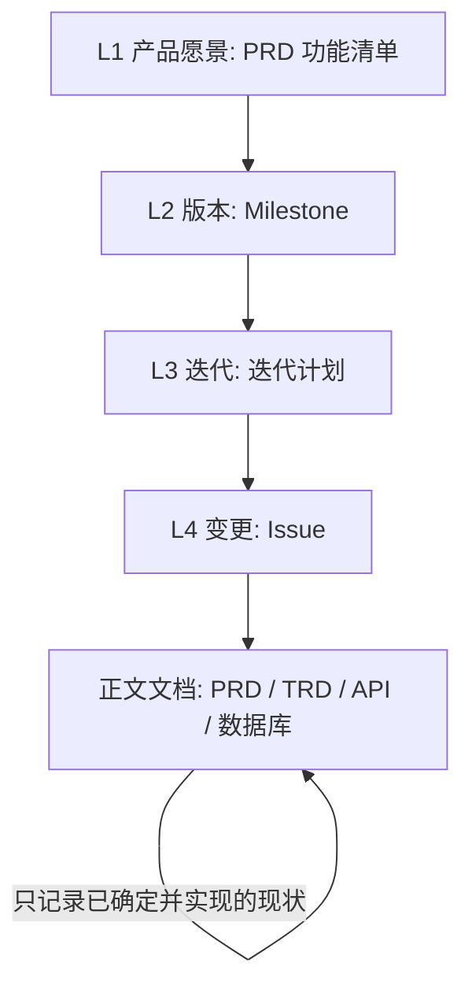
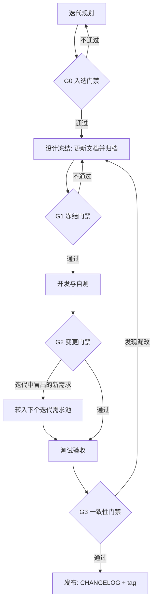
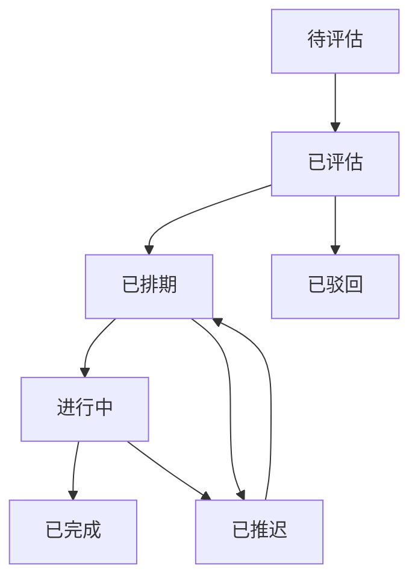

# 迭代与版本规划规范

> 项目名称：OA 智能办公管理系统
> 文档版本：v1.0
> 最后更新：2026-10-06
> 适用对象：研发、产品、测试

---

## 1. 文档说明

本文档定义**一个迭代周期内**文档与需求的组织方式：需求怎么排进迭代、文档在迭代的哪个时点交付、多个变更同时命中同一份文档时如何避免冲突、迭代收尾时如何确认文档没有漏改。

配套文档：

- 单次变更的九步流程：[需求开发流程](需求开发流程.md)
- 版本号与归档规则：[变更管理规范](变更管理规范.md)
- 文档具体写法：[文档编写规范](文档编写规范.md)

术语表：

| 术语 | 含义 |
| --- | --- |
| 迭代 | 一段固定长度的时间盒，本期交付预先排定的若干 Issue |
| 需求池 | 尚未排入任何迭代的候选变更集合 |
| 门禁 | 进入下一阶段前必须满足的检查条件，不满足则不得推进 |
| 完成定义（DoD） | 一个 Issue 被视为"真正做完"的全部条件 |
| 文档债务 | 代码已合入但对应文档未同步所形成的欠账 |

---

## 2. 为什么需要迭代规划

现有三份规范解决的是"**一次变更怎么办**"，本文解决的是"**一批变更怎么编排**"。两者的覆盖范围不同：

| 规范 | 回答的问题 | 不覆盖的部分 |
| --- | --- | --- |
| [需求开发流程](需求开发流程.md) | 一次变更要走哪些步骤 | 多个变更如何组织成一批 |
| [变更管理规范](变更管理规范.md) | 版本号怎么升、旧版怎么归档 | 归档与升版的**时间粒度**由谁决定 |
| [文档编写规范](文档编写规范.md) | 文档的结构与表达怎么写 | — |
| **本文** | **一个迭代内多变更如何编排** | — |

缺少迭代层会导致三个典型问题：

| 问题 | 具体表现 | 后果 |
| --- | --- | --- |
| 版本账目不清 | 迭代结束时说不清"这批代码对应文档的哪个版本" | 无法回滚到确定的文档基线 |
| 版本号噪音 | 同一份 PRD 被多个 Issue 轮流改，版本号一周跳到 v1.4 | 读者无法分辨相邻版本差异 |
| 文档债务累积 | 代码合了、文档忘了，且没有检查点暴露 | 文档逐渐失去可信度 |

> 📌 **本文的地位**：它是[需求开发流程](需求开发流程.md)之上的**编排层**，不替代也不修改九步法。九步法负责"单个 Issue 怎么走"，本文负责"这些 Issue 怎么排成一批、文档在批次里何时定稿"。

---

## 3. 四层规划模型

规划内容必须分层存放，**不同层级的载体不得混用**：

| 层级 | 载体 | 时间尺度 | 更新频率 | 回答什么 |
| --- | --- | --- | --- | --- |
| L1 产品愿景 | [PRD](../01-产品/PRD-产品需求文档.md) 的功能清单与[边界限制](../01-产品/PRD-产品需求文档.md) | 季度 | 极低 | 系统最终要成为什么 |
| L2 版本 | GitHub Milestone + [CHANGELOG](../CHANGELOG.md) | 月 / 每个版本 | 每次发布 | 这个版本对外交付什么 |
| L3 迭代 | 迭代计划（[迭代计划模板](../_templates/迭代计划模板.md)） | 1~2 周 | 每迭代 | 这段时间做哪些 Issue |
| L4 变更 | GitHub Issue | 天 | 随时 | 某一个具体改动怎么做 |

### 3.1 铁律：计划向上，现状向下



上图说明：计划类内容自上而下逐层细化，**正文文档位于最底端，只承接"已经落地"的现状**，不承接任何计划。

| 内容 | 应放位置 | 不得放入 |
| --- | --- | --- |
| "下个版本计划支持供应商管理" | 迭代计划 / Milestone | ❌ PRD |
| "系统已支持按供应商筛选商品" | PRD | — |
| "考虑把内存分页改成 SQL 分页" | Issue（`type:refactor`） | ❌ TRD |
| "所有列表接口已改用 `PageUtils` 统一分页" | TRD | — |

> ⚠️ **最常见的污染**：把"待做事项"写进 PRD 或 TRD 的技能清单。一旦正文出现未来时态，读者就无法判断某功能到底是"已有"还是"计划中"，正文作为"当前真相"的价值立刻崩塌。计划内容一律走 Issue 或迭代计划。

### 3.2 各层对应的文档动作

| 层级变化 | 需要动的文档 | 不需要动的文档 |
| --- | --- | --- |
| L1 愿景调整 | PRD、TRD | API、数据库 |
| L2 版本发布 | CHANGELOG、各文档变更记录表 | 正文内容通常不变 |
| L3 迭代规划 | 迭代计划（新建） | 全部正文文档 |
| L4 具体变更 | 按[影响评估表](变更管理规范.md#6-变更影响评估表)确定 | 未受影响的文档一律不动 |

> 💡 L3 迭代规划阶段**不应改动任何正文文档**。规划只产出"下一迭代要做哪些 Issue"，文档改动发生在迭代内的设计冻结阶段（见第 5 节）。

---

## 4. 迭代周期与节奏

### 4.1 迭代长度

| 团队规模 | 建议长度 | 依据 |
| --- | --- | --- |
| 单人维护 | 1 周 | 反馈快，避免计划与实际脱节 |
| 2~4 人 | 2 周 | 留出联调与评审时间 |
| 5 人以上 | 2 周 + 中期检查 | 需要对齐成本 |

> 📌 **本项目当前为单人维护，默认采用 1 周迭代**。团队扩张后调整为 2 周，并同步更新本节。

### 4.2 一周迭代的节奏

| 时点 | 活动 | 主要产出 |
| --- | --- | --- |
| D1 上午 | 迭代规划：从需求池挑 Issue、填影响评估、定验收标准 | 迭代计划 |
| D1 下午 | 设计冻结：更新受影响文档、归档旧版、升版本号 | 定稿文档 + 归档快照 |
| D2~D4 | 开发与自测，按 Issue 逐个提交 | 代码 + 自测记录 |
| D5 上午 | 测试验收 | 验收记录 |
| D5 下午 | 发布与复盘：更新 CHANGELOG、打 tag、复盘 | Release 标签 + 复盘结论 |

### 4.3 迭代容量控制

**迭代容量指一个迭代能容纳的 Issue 数量上限**，由上一迭代的实际完成量决定，而不是由期望决定：

| 规则 | 说明 |
| --- | --- |
| 首个迭代 | 保守估 3~5 个 Issue |
| 后续迭代 | 取上迭代**实际完成**数量的平均值 |
| 超出容量 | 新 Issue 直接进需求池，**不得插队** |
| 紧急插队 | 仅 P0 允许，且必须移出等量的原计划 Issue |

> ⚠️ 迭代容量只统计**完成**的 Issue，不统计"做了大半的"。未完成的计入下一迭代容量评估时要打折，否则会持续高估。

---

## 5. 迭代内的文档时间轴

### 5.1 时间轴总览



上图说明：四个门禁把迭代切成五段，**文档改动集中在"设计冻结"这一段完成**，开发阶段原则上不再改需求文档。

### 5.2 各阶段的文档动作

| 阶段 | 文档动作 | 责任人 |
| --- | --- | --- |
| 迭代规划 | 新建迭代计划，汇总各 Issue 的[影响评估表](变更管理规范.md#6-变更影响评估表)；**不动正文文档** | 研发负责人 |
| 设计冻结 | 按影响评估汇总结果，逐个更新受影响文档；先归档旧版，再改正文，再升版本号 | 各文档责任人 |
| 开发与自测 | 仅允许补充"实现细节遗漏"，不允许变更需求语义；发现需求问题一律转 Issue | 研发 |
| 测试验收 | 以 Issue 验收标准为准，核对该 Issue 涉及的文档已定稿 | 测试 |
| 发布与复盘 | 更新 CHANGELOG；核对各文档变更记录表已补全；执行文档清算（见第 10 节） | 研发 / 运维 |

### 5.3 为什么文档必须先于代码定稿

迭代内的文档动作集中在设计冻结阶段，而不是边写代码边补文档，原因有三：

| 原因 | 说明 |
| --- | --- |
| 文档是设计的产出物 | 先定接口与表结构再编码，本身就是设计行为；后补文档等于放弃设计 |
| 避免连锁返工 | 编码完成后发现接口设计要改，代码与文档都要推翻重来 |
| 验收有锚点 | 验收对照的是冻结时的文档与 Issue 验收标准，中途漂移会使验收失去依据 |

> ⚠️ **例外**：纯实现层重构（`type:refactor`，对外可观测行为不变）不涉及需求文档，其技术方案更新可随代码同步提交，但仍需在[影响评估表](变更管理规范.md#6-变更影响评估表)中注明"PRD 不受影响"。

---

## 6. 门禁检查清单

门禁不通过则**不得进入下一阶段**。四个门禁的检查项如下。

### 6.1 G0 入迭门禁

在迭代规划阶段，对每个候选 Issue 逐项确认：

- [ ] 有对应 Issue 且编号已记录在迭代计划中
- [ ] 影响评估表已填写，明确列出受影响的文档
- [ ] 验收标准可测量，不含"体验更好""优化一下"这类描述
- [ ] 已标注优先级（P0~P3）
- [ ] 已评估是否涉及数据库迁移与破坏性变更

### 6.2 G1 冻结门禁

进入开发前，对每个受影响文档逐项确认：

- [ ] 正文已按本迭代需求更新完毕
- [ ] 旧版本已归档到 `docs/archive/`，归档文件头部已加历史版本标注
- [ ] 文档头部「文档版本」已递增
- [ ] 文末「变更记录」表已补行（含关联 Issue 编号）
- [ ] 文档改动与代码改动计划在**同一个 PR** 中提交
- [ ] 受影响文档之间已交叉核对，无相互矛盾

### 6.3 G2 变更门禁

开发过程中出现新需求或需求变更时：

- [ ] 判断是否影响**本迭代已冻结**的验收标准
- [ ] 影响则**不修改本迭代文档**，改为新建 Issue 并转入下个迭代需求池
- [ ] 不影响（仅实现细节）则允许随代码提交
- [ ] 在迭代计划的"范围变更"栏记录该决定与原因

### 6.4 G3 一致性门禁

发布前执行文档清算：

- [ ] 运行 `python scripts/check-docs.py`，退出码为 0
- [ ] 运行 `python scripts/check-doc-sync.py`，无"疑似漏改"告警
- [ ] 本迭代每个已完成 Issue 的验收记录已填写
- [ ] CHANGELOG 已录入本迭代交付内容
- [ ] 各文档「变更记录」表与迭代计划中的 Issue 清单可互相印证

---

## 7. 并行变更的文档冲突规则

### 7.1 冲突是怎么产生的

[变更管理规范](变更管理规范.md#4-归档规范)的默认粒度是"**每次变更归档一次、升版一次**"。当一个迭代内有多个 Issue 命中**同一份文档**时，按默认粒度执行会产生噪音：

| 情形 | 默认粒度的结果 | 问题 |
| --- | --- | --- |
| 3 个 Issue 都改 PRD | 归档 `PRD-v1.1`、`PRD-v1.2`、`PRD-v1.3` | 三个快照差异极小，读者无法分辨 |
| 各 Issue 在不同分支并行改 PRD | 三个分支各自升到 v1.1 | 合并时版本号冲突，归档文件互相覆盖 |

### 7.2 两条规则

**规则一：同一份文档在同一迭代内只允许一个写者。**

| 做法 | 说明 |
| --- | --- |
| ✅ 文档单点写者 | 迭代内每份文档指定一人负责，其改动集中在一个分支串行完成 |
| ❌ 多人并行改同一文档 | 合并冲突与版本号冲突的根源 |

**规则二：归档与升版可采用"迭代粒度"。**

当一个迭代内有多个 Issue 命中同一文档时，**允许**改为按迭代粒度处理：

```text
迭代开始（设计冻结）：
  cp docs/01-产品/PRD-产品需求文档.md docs/archive/PRD-v1.0.md   # 只归档一次旧版
  # 依次落实本迭代全部命中 PRD 的 Issue，正文连续修改
  # 头部版本号只递增一次：v1.0 → v1.1
  # 文末变更记录表只加一行，变更内容汇总本迭代的多个 Issue
```

此时「变更记录」表中该行的写法：

| 版本 | 日期 | 变更内容 | 关联 Issue | 修改人 |
| --- | --- | --- | --- | --- |
| v1.1 | 2026-10-12 | 商品新增供应商字段；订单超时调整为 60 分钟；列表接口统一分页参数 | #12 #14 #17 | 张三 |

> 📌 **两种粒度都合法，但必须选定一种并保持一致**。迭代粒度适合"小改动密集"的迭代；变更粒度适合"改动稀疏、跨度大"的场景。粒度混用会让归档目录失去可预测性。

### 7.3 归档文件命名

采用迭代粒度时，归档文件名仍遵循[变更管理规范](变更管理规范.md#43-归档命名规范)的两段式版本号，**不在文件名中引入迭代号**：

| 做法 | 示例 |
| --- | --- |
| ✅ 正确 | `PRD-v1.0.md`、`PRD-v1.1.md` |
| ❌ 错误 | `PRD-v1.0-iter3.md`、`PRD-sprint5.md` |

> 💡 需要追溯"某快照属于哪个迭代"时，查 `docs/archive/README.md` 的登记表即可，不必把迭代信息塞进文件名 —— 文件名只承担"版本"这一个维度的语义。

---

## 8. 迭代文档完成定义

一个 Issue 只有在满足**全部**下列条件后，才可标记为完成：

| 维度 | 条件 |
| --- | --- |
| 文档 | 影响评估表中勾选的文档**全部**已更新 |
| 三件套 | 每份被改文档均完成"改正文 + 升版本号 + 补变更记录" |
| 归档 | 旧版本已归档，归档文件头部有历史版本标注，且已在[归档目录说明](../archive/README.md)登记 |
| 脚本 | `python scripts/check-docs.py` 退出码为 0 |
| 同步 | 涉及数据库变更时，`sql/` 脚本与[数据库设计文档](../04-数据库/数据库设计文档.md)已同步 |
| 提交 | 文档改动与代码改动在**同一个 PR** 中 |
| 验收 | 验收记录已填写并关联该 Issue |

> ⚠️ **"代码写完"不等于"Issue 完成"**。文档、归档、验收任一项缺失，该 Issue 只能处于进行中，并计入下个迭代的容量修正。

---

## 9. 需求池与优先级

### 9.1 需求池状态流转



上图说明：需求池用 Issue 标签表达状态，只有「已排期」的 Issue 才能进入迭代计划。

| 状态 | 对应标签 | 进入条件 |
| --- | --- | --- |
| 待评估 | 无标签 | 刚提交的 Issue |
| 已评估 | 已加 `type:*` 与 `scope:*` | 影响评估表填写完整 |
| 已排期 | 已加入 Milestone | 优先级确定为 P1 或 P2 |
| 进行中 | 已加入当前迭代计划 | 通过 G0 门禁 |
| 已完成 | Issue 已关闭 | 满足第 8 节完成定义 |
| 已推迟 | 加 `status:deferred` | 迭代未做完，回池并注明原因 |
| 已驳回 | Issue 已关闭 | 评审未通过，注明理由 |

### 9.2 优先级定义

| 优先级 | 含义 | 响应要求 |
| --- | --- | --- |
| P0 | 线上阻断或数据安全问题 | 立即处理，可插队 |
| P1 | 本迭代必须交付 | 排入当前迭代 |
| P2 | 下个迭代计划 | 排入下个迭代或留池 |
| P3 | 待评估 | 留在池中，不承诺时间 |

> 📌 **优先级由影响面决定，而非提出人的迫切程度**。判断依据：影响多少用户、是否阻断主流程、是否造成数据错误。参考 [CHANGELOG 已知问题](../CHANGELOG.md) 中的最高优先级项（安全类）始终为 P0。

---

## 10. 迭代收尾与复盘

### 10.1 文档清算

迭代末执行一次代码与文档的比对，确认没有"改了代码忘了文档"：

```bash
# 检查本迭代区间内代码改动是否有对应文档改动
python scripts/check-doc-sync.py --from v1.0.0 --to HEAD
```

检查器依据路径规则映射，输出疑似漏改项：

| 代码改动路径 | 期望同步的文档 |
| --- | --- |
| `**/*Controller.java`、`**/controller/**` | [API 接口文档](../03-接口/API-接口文档.md) |
| `**/entity/**`、`sql/**` | [数据库设计文档](../04-数据库/数据库设计文档.md) |
| `**/application*.yml`、`Dockerfile`、`docker-compose*.yml` | [部署运维手册](../05-运维/部署运维手册.md) |
| `oa-frontend/src/router/**` | [API 接口文档](../03-接口/API-接口文档.md) 或 PRD（视是否新增页面） |
| `**/*Service.java` 出现新功能语义 | [TRD](../02-技术/TRD-技术设计文档.md) 或 PRD |

> ⚠️ 检查器只能发现**路径层面**的缺失，无法判断文档内容是否写对。它的定位是"提醒清单"，不是"通过证明"。

### 10.2 迭代复盘

每个迭代结束后，在迭代计划中补充复盘小节，回答四个问题：

| 问题 | 关注点 |
| --- | --- |
| 计划了几项、完成了几项 | 迭代容量估算是否准确 |
| 哪些 Issue 被推迟，为什么 | 是估算问题还是外部打断 |
| 文档是否有返工 | 冻结阶段定稿是否充分 |
| 下个迭代容量取多少 | 给出具体数量 |

> 💡 复盘结论要**可执行**，例如"下个迭代容量定为 4 个 Issue"，而不是"以后注意估算"。不可执行的结论等于没写。

---

## 11. 文档健康度指标

用下列指标衡量迭代期的文档质量，每迭代复盘时统计一次：

| 指标 | 含义 | 目标值 |
| --- | --- | --- |
| 文档滞后率 | 代码已合入但文档未同步的 Issue 占比 | 0 |
| 归档完整率 | 被改文档中有归档快照的比例 | 100% |
| 检查器通过率 | `check-docs.py` 通过次数 / 总提交次数 | 100% |
| 变更记录覆盖率 | 变更记录表中带有 Issue 编号的行占比 | 90% 以上 |
| 未立单改动 | 无 Issue 直接改文档或代码的次数 | 0 |

> 📌 指标只用于**发现系统性偏差**，不用于考核。持续偏高说明流程某环节形同虚设，应回到对应章节修正规范，而不是追究个人。

---

## 12. 反模式

| 反模式 | 问题 | 正确做法 |
| --- | --- | --- |
| 把计划写进 PRD | 读者分不清"已有"与"计划中" | 计划进迭代计划 / Issue |
| 迭代规划阶段就改正文文档 | 规划与冻结两阶段混淆 | 规划只排 Issue，冻结才改文档 |
| 边写代码边补文档 | 设计倒置，易连锁返工 | 冻结阶段先定稿文档 |
| 迭代中顺手改需求 | 验收标准漂移 | 新需求转下个迭代需求池 |
| 多人并行改同一份文档 | 合并与版本号冲突 | 一份文档一个写者 |
| 每个小 Issue 都归档升版 | 归档目录膨胀、版本号噪音 | 迭代粒度归档与升版 |
| 归档文件名带迭代号 | 文件名语义混乱 | 只用版本号，迭代信息进登记表 |
| 迭代塞满 Issue | 完不成，债务滚雪球 | 容量按上迭代实际完成量取 |
| 复盘只写"下次注意" | 不可执行，等于没写 | 给出具体数字与动作 |
| 迭代末不做文档清算 | 漏改长期潜伏 | 跑检查器 + 核对台账 |

---

## 13. 速查卡

```text
┌───────────────────────────────────────────────────────┐
│  迭代期文档规划速查                                    │
├───────────────────────────────────────────────────────┤
│  D1 上午  规划：挑 Issue → 填影响评估 → 定验收标准     │
│           不动任何正文文档                             │
│  D1 下午  冻结：归档旧版 → 改正文 → 升版本 → 补记录    │
│           文档与代码计划同 PR                          │
│  D2~D4    开发：需求语义一律冻结，新想法转需求池       │
│  D5 上午  验收：以 Issue 验收标准为准，核对文档已定稿  │
│  D5 下午  发布：CHANGELOG + tag + 文档清算 + 复盘       │
├───────────────────────────────────────────────────────┤
│  铁律：计划向上（Issue/迭代计划），现状向下（正文文档）│
│  铁律：文档先于代码定稿                                │
│  铁律：一份文档一个写者；归档与升版选一种粒度并坚持     │
│  铁律：迭代中新需求不插队，转下个迭代需求池            │
└───────────────────────────────────────────────────────┘
```

---

## 14. 相关文档

- [需求开发流程](需求开发流程.md) — 单次变更的九步法
- [变更管理规范](变更管理规范.md) — 版本号、归档、变更记录规则
- [文档编写规范](文档编写规范.md) — 文档结构、格式与表达规则
- [开发规范与贡献指南](开发规范与贡献指南.md) — 编码与 Git 规范
- [迭代计划模板](../_templates/迭代计划模板.md) — 迭代计划的填写骨架
- [归档目录说明](../archive/README.md) — 历史版本文档索引
- [CHANGELOG](../CHANGELOG.md) — 项目级版本发布记录
- [文档导航](../README.md) — 文档索引与标记约定
- 检查器脚本：`scripts/check-docs.py`、`scripts/check-doc-sync.py`

---

## 变更记录

| 版本 | 日期 | 变更内容 | 关联 Issue | 修改人 |
| --- | --- | --- | --- | --- |
| v1.0 | 2026-10-06 | 初版，定义四层规划模型、迭代节奏、文档时间轴与门禁、并行冲突规则、完成定义与收尾清算 | — | — |
