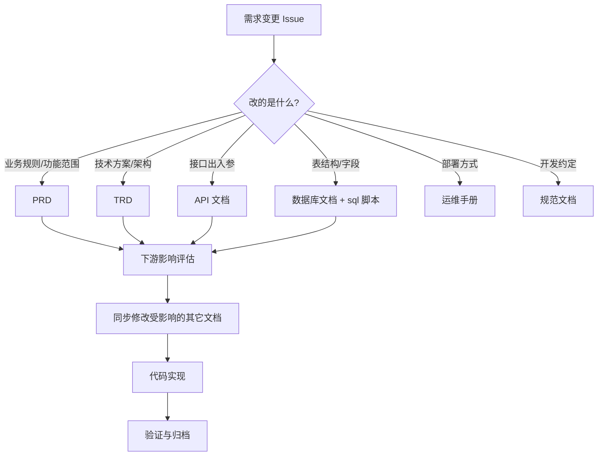
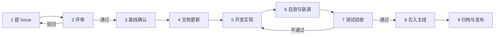

# 需求开发流程

> 项目名称：OA 智能办公管理系统
> 文档版本：v1.0
> 最后更新：2026-10-04
> 适用对象：全体研发、产品、测试

---

## 1. 为什么需要这个流程

一句话回答最常见的问题：

> **"我要改某个功能，是直接在 PRD 文档里改吗？"**

**不是。** 直接改 PRD 正文会导致三个问题：

| 问题 | 后果 |
| --- | --- |
| 无法追溯 | 没人知道某功能是最初就要的，还是后来加的 |
| 测试失锚 | 测试用例对着旧 PRD 写的，PRD 变了用例没变，验收失去依据 |
| 协作冲突 | 多人同改一份文件，容易互相覆盖 |

**正确做法**：需求变更走**单据（GitHub Issue）驱动**，评审通过后再同步修改文档与代码，并**归档历史版本**。

---

## 2. 核心原则

### 2.1 三条铁律

| 原则 | 说明 |
| --- | --- |
| **先立单，后动手** | 任何需求变更必须先有 Issue，没有 Issue 不改文档、不写代码 |
| **文档分级** | PRD 记"要什么"，TRD 记"怎么做"，API 记"怎么调"，数据库记"怎么存"。改一处要判断影响几处 |
| **正文是当前版，历史进归档** | 文档正文永远只描述**当前有效**的需求；旧版本归档到 `docs/archive/` |

### 2.2 文档分级与变更触发



**关键**：变更往往**不止影响一份文档**。例如"给商品加一个供应商字段"：

| 文档 | 是否受影响 | 具体改动 |
| --- | --- | --- |
| PRD | ✅ | 商品管理功能描述补充字段 |
| TRD | ⚠️ 可能 | 若字段来自外部服务，需说明数据来源 |
| API 文档 | ✅ | 商品新增/编辑/详情的请求响应结构 |
| 数据库文档 | ✅ | `sys_product` 表加字段 + 迁移脚本 |
| 运维手册 | ❌ | 无影响 |
| 规范文档 | ❌ | 无影响 |

---

## 3. 端到端流程

### 3.1 全流程总览



### 3.2 各阶段详解

#### 阶段 1：提出变更（提 Issue）

| 项 | 内容 |
| --- | --- |
| **责任人** | 需求提出方（产品 / 业务 / 研发） |
| **动作** | 在 GitHub 创建 Issue，选择 **变更申请单** 模板 |
| **交付物** | 完整的 Issue（背景、变更内容、影响范围、验收标准） |
| **模板** | [变更申请单模板](../_templates/变更申请单模板.md) |

**Issue 标题规范**：

```text
[变更] 商品管理新增供应商字段
[新增] 物流轨迹支持批量导入
[修复] 订单状态流转缺少已取消状态
```

**标签（Label）**：

| 标签 | 含义 |
| --- | --- |
| `type:feature` | 新功能 |
| `type:change` | 需求变更 |
| `type:bug` | 缺陷修复 |
| `type:refactor` | 重构 |
| `scope:system` / `scope:business` / `scope:ai` / `scope:frontend` | 影响模块 |
| `impact:db` | 涉及数据库变更 |
| `impact:api` | 涉及接口变更 |
| `impact:breaking` | 破坏性变更 |

#### 阶段 2：评审

| 项 | 内容 |
| --- | --- |
| **责任人** | 产品 + 研发负责人 + 测试（+ DBA 视情况） |
| **动作** | 在 Issue 中讨论，逐项确认影响范围与验收标准 |
| **交付物** | Issue 中的评审结论评论 |
| **通过条件** | 背景清晰 + 验收标准可测 + 影响范围已识别 + 工作量已评估 |

**评审检查点**：

- [ ] 需求背景与价值是否清楚
- [ ] 变更内容是否具体、无歧义
- [ ] 验收标准是否**可测量**（避免"体验更好"这类描述）
- [ ] 影响范围是否完整（PRD / TRD / API / DB / 兼容性）
- [ ] 是否有破坏性变更，是否需兼容过渡
- [ ] 是否需要数据迁移
- [ ] 是否影响已有功能与测试用例
- [ ] 工作量与排期是否可接受

**评审结论**：

| 结论 | 后续动作 |
| --- | --- |
| 通过 | 进入阶段 3 |
| 需补充 | 提 Issue 者补充信息后重评 |
| 驳回 | 关闭 Issue 并说明原因 |

#### 阶段 3：基线确认

| 项 | 内容 |
| --- | --- |
| **责任人** | 研发负责人 |
| **动作** | 评审通过后，**立即归档当前文档版本**，避免后续改动污染基线 |
| **交付物** | `docs/archive/` 下的版本快照 |

**归档时机**：评审通过后、动手改文档前。

```bash
# 归档当前版本（示例：PRD v1.0）
cp docs/01-产品/PRD-产品需求文档.md docs/archive/PRD-v1.0.md
```

> 💡 为什么先归档再改？因为归档是"封存历史基线"，改完正文后旧内容就找不回来了。顺序反了会导致归档的是新版。

#### 阶段 4：文档更新

| 项 | 内容 |
| --- | --- |
| **责任人** | 产品（PRD）/ 研发（TRD、API、DB）/ 运维（运维手册） |
| **动作** | 按 3.2 节的影响评估表，同步修改受影响的文档 |
| **交付物** | 文档改动 + 各文档文末的变更记录表新增一行 |

**文档改动三件套**（每份被改的文档都要做）：

1. **改正文** — 按当前有效需求调整内容
2. **升版本号** — 文档头部的"文档版本"字段递增
3. **记变更** — 文末"变更记录"表新增一行（版本、日期、变更内容、关联 Issue、修改人）

**变更记录表示例**：

| 版本 | 日期 | 变更内容 | 关联 Issue | 修改人 |
| --- | --- | --- | --- | --- |
| v1.0 | 2026-10-04 | 初版 | — | — |
| v1.1 | 2026-10-10 | 商品管理新增供应商字段 | #12 | 张三 |

#### 阶段 5：开发实现

| 项 | 内容 |
| --- | --- |
| **责任人** | 研发 |
| **动作** | 从 `dev` 拉分支开发，实现功能 |
| **交付物** | 代码 + 单元测试 |

**分支命名**（与 Issue 关联）：

```bash
# 格式：<type>/<issue编号>-<简短描述>
git checkout dev
git checkout -b feature/12-product-supplier
git checkout -b bugfix/15-order-status-cancel
```

**提交信息**（关联 Issue）：

```text
feat(business): 商品管理新增供应商字段 (#12)

- 商品实体与 DTO 新增 supplier 字段
- 补充数据库迁移脚本
- 同步更新 API 与数据库文档
```

> 提交信息中的 `(#12)` 会被 GitHub 自动关联到 Issue。

#### 阶段 6：自测与联调

| 项 | 内容 |
| --- | --- |
| **责任人** | 研发 |
| **动作** | 本地自测 + 与前端/上下游联调 |
| **交付物** | 自测记录（在 Issue 中勾选检查清单） |

**自测检查清单**：

- [ ] 服务正常启动
- [ ] 登录链路正常（验证 JWT 未被破坏）
- [ ] 新功能符合 Issue 中的验收标准
- [ ] 原功能未被破坏（回归检查）
- [ ] 接口出入参与 API 文档一致
- [ ] 未带入密钥、调试代码
- [ ] 涉及数据库变更已验证迁移脚本可执行

#### 阶段 7：测试验收

| 项 | 内容 |
| --- | --- |
| **责任人** | 测试 |
| **动作** | 依据 Issue 的验收标准 + PRD 编写并执行测试用例 |
| **交付物** | 测试用例、测试报告 |
| **模板** | [验收记录模板](../_templates/验收记录模板.md) |

**验收依据的优先级**：

```text
Issue 的验收标准  >  当前版 PRD  >  口头描述
```

> ⚠️ 若发现 PRD 与 Issue 不一致，**以 Issue 为准**（Issue 是最新的变更载体），同时应回头修正 PRD 以保持一致。

#### 阶段 8：合入主线

| 项 | 内容 |
| --- | --- |
| **责任人** | 研发 |
| **动作** | 提 Pull Request 合入 `dev`，代码审查通过后合并 |
| **交付物** | 已合并的 PR |

**PR 要求**：

- [ ] 关联对应 Issue（`Closes #12`）
- [ ] 文档改动与代码改动在**同一个 PR** 中提交
- [ ] 通过代码审查（见 [开发规范 · 代码审查清单](开发规范与贡献指南.md#9-代码审查清单)）

> 💡 **强烈建议**：文档改动必须与代码改动同 PR。分开提交极易出现"代码上了、文档忘了"的情况。

#### 阶段 9：归档与发布

| 项 | 内容 |
| --- | --- |
| **责任人** | 研发 / 运维 |
| **动作** | 合入 `master`、打标签、更新总 CHANGELOG |
| **交付物** | Release 标签 + [CHANGELOG](../CHANGELOG.md) 更新 |

```bash
# 合入 master 并打标签
git checkout master
git merge dev
git tag -a v1.1.0 -m "商品管理新增供应商字段"
git push origin master --tags
```

**同步更新**：

- [ ] `docs/CHANGELOG.md` 新增版本条目
- [ ] 各文档文末变更记录表已更新
- [ ] Issue 已关闭

---

## 4. 三个典型场景

### 场景 A：小改动（改一个字段）

比如"商品列表增加按供应商筛选"。

```text
Issue 提单（用变更申请单模板）
  ↓ 简评：研发确认影响 PRD + API + DB 三处
  ↓ 归档当前版本
  ↓ 改 PRD（功能描述）+ API（查询参数）+ DB（加索引）
  ↓ 一个 PR 同时提交代码 + 三份文档
  ↓ 自测 → 验收 → 合入
```

**要点**：小改动也要立单，但评审可以简化为研发内部确认。

### 场景 B：需求变更（改已有规则）

比如"订单超时时间从 30 分钟改为 60 分钟"。

```text
Issue 提单（重点写：原规则是什么、新规则是什么、为什么要改）
  ↓ 评审：产品 + 研发 + 测试，重点确认对已有订单的影响
  ↓ 归档 PRD
  ↓ 改 PRD（业务规则）+ TRD（若涉及定时任务配置）
  ↓ 开发 + 更新测试用例
  ↓ 验收（重点测历史数据处理）
```

**要点**：变更必须写清**"从什么改成什么"**，而不是只写"改成新的"。

### 场景 C：新技术方案（不动需求，只动实现）

比如"把零散的 MCP 调用缓存换成本地缓存"。

```text
Issue 提单（type:refactor，说明：需求不变，仅换实现）
  ↓ 评审：只需研发内部评审
  ↓ 归档 TRD
  ↓ 只改 TRD（技术方案）+ 可能改运维手册（配置项）
  ↓ PRD 不动 ← 重要：需求没变就不要动 PRD
```

**要点**：**只改受影响的文档**。需求没变却去改 PRD，反而会污染基线的可信度。

---

## 5. 文档与代码的对应关系

| 你想知道… | 看哪份文档 | 变更时谁来改 |
| --- | --- | --- |
| 这个功能是干什么的、给谁用 | PRD | 产品 |
| 这个功能怎么实现的、为什么这么设计 | TRD | 研发 |
| 这个接口怎么调、参数是什么 | API 文档 | 后端研发 |
| 数据存在哪张表、字段什么含义 | 数据库文档 | 后端研发 |
| 怎么部署、出问题怎么排查 | 运维手册 | 研发 / 运维 |
| 代码怎么写、提交怎么规范 | 规范文档 | 团队共识 |

---

## 6. 常见疑问

### Q1：直接用 GitHub Issue 记，还需要改 PRD 吗？

**需要，但目的不同。**

| 载体 | 定位 | 生命周期 |
| --- | --- | --- |
| Issue | **变更过程的记录**（谁提的、为什么改、怎么评审的） | 完成后关闭，作为历史档案 |
| PRD | **当前需求的唯一真相**（现在系统应该是什么样） | 长期维护，持续演进 |

Issue 回答"**为什么要变成这样**"，PRD 回答"**现在应该是什么样**"。新人只看 PRD 就知道系统现状，不需要翻几百个 Issue。

### Q2：小改动也要走完整流程吗？

不必。流程可**按影响面裁剪**：

| 改动规模 | 评审 | 归档 | 文档 |
| --- | --- | --- | --- |
| 改文案 / 样式 | 免评审 | 免归档 | 通常无需改文档 |
| 改单个字段 | 研发内部确认 | 归档 | 改 API + DB |
| 改业务规则 | 产品 + 研发 + 测试 | 归档 | 改 PRD + 下游 |
| 改架构 | 全员评审 | 归档 | 改 TRD |

**判断标准**：**是否改变了对外的可观测行为**。改了就要立单。

### Q3：归档要归档哪些文档？

**只归档"会被改的那份"**。不是每次都全量归档：

```bash
# 只归档本次要改的文档
cp docs/01-产品/PRD-产品需求文档.md docs/archive/PRD-v1.0.md

# ❌ 不要每次都把 6 份文档全部复制一遍
```

**归档命名规范**：

```text
docs/archive/
├── README.md              # 归档说明
├── PRD-v1.0.md
├── PRD-v1.1.md
├── TRD-v1.0.md
└── API-v1.0.md
```

### Q4：历史版本用 Git 管不就行了吗？

Git 是**兜底**，不能替代**归档**：

| 方式 | 优点 | 缺点 |
| --- | --- | --- |
| Git 历史 | 完整、无额外成本 | 需要会用 `git show`，非技术同学看不了 |
| archive 归档 | 任何人可读、一目了然 | 有文件冗余 |

**结论**：两者都要。归档面向"人"，Git 面向"机器"。

### Q5：如果需求和实现不一致，改哪个？

| 情况 | 处理 |
| --- | --- |
| 实现错了 | 改代码，文档不动 |
| 需求变了 | 立 Issue，改文档 + 改代码 |
| 文档写错了 | 改文档，代码不动 |
| 说不清 | **立 Issue 澄清**，不要凭猜 |

**核心**：**不要在没立单的情况下擅自改文档或代码**。

---

## 7. 流程速查卡

```text
┌─────────────────────────────────────────────────────┐
│  需求变更九步法                                       │
├─────────────────────────────────────────────────────┤
│  1. 提 Issue（用变更申请单模板）                      │
│  2. 评审（产品 + 研发 + 测试）                        │
│  3. 归档当前文档版本 → docs/archive/                  │
│  4. 改文档（正文 + 版本号 + 变更记录表）              │
│  5. 开发（从 dev 拉 feature/issue-xxx 分支）          │
│  6. 自测与联调                                        │
│  7. 测试验收（以 Issue 验收标准为准）                 │
│  8. 合入（文档与代码同一个 PR）                       │
│  9. 归档与发布（打 tag + 更新 CHANGELOG）             │
├─────────────────────────────────────────────────────┤
│  铁律：先立单 → 再改文档 → 后写代码                   │
│  铁律：只改受影响的文档，不要无差别全改               │
│  铁律：文档改动与代码改动在同一个 PR                  │
└─────────────────────────────────────────────────────┘
```

---

## 8. 模板与工具

| 模板 | 用途 | 位置 |
| --- | --- | --- |
| 变更申请单 | GitHub Issue 提单 | [docs/_templates/变更申请单模板.md](../_templates/变更申请单模板.md) |
| 需求评审记录 | 记录评审结论 | [docs/_templates/需求评审记录模板.md](../_templates/需求评审记录模板.md) |
| 验收记录 | 测试验收留痕 | [docs/_templates/验收记录模板.md](../_templates/验收记录模板.md) |

**GitHub Issue 模板**（仓库 `.github/ISSUE_TEMPLATE/` 下，创建 Issue 时自动可选）：

| 文件 | 对应场景 |
| --- | --- |
| `变更申请单.yml` | 需求变更 |
| `缺陷报告.yml` | Bug 报告 |

---

## 9. 相关文档

- [变更管理规范](变更管理规范.md) — 版本号、归档、变更记录的具体规则
- [开发规范与贡献指南](开发规范与贡献指南.md) — 编码与 Git 规范
- [文档导航](../README.md)
- [CHANGELOG](../CHANGELOG.md)

---

## 变更记录

| 版本 | 日期 | 变更内容 | 关联 Issue | 修改人 |
| --- | --- | --- | --- | --- |
| v1.0 | 2026-10-04 | 初版，定义 Issue 驱动的需求开发九步法 | — | — |
